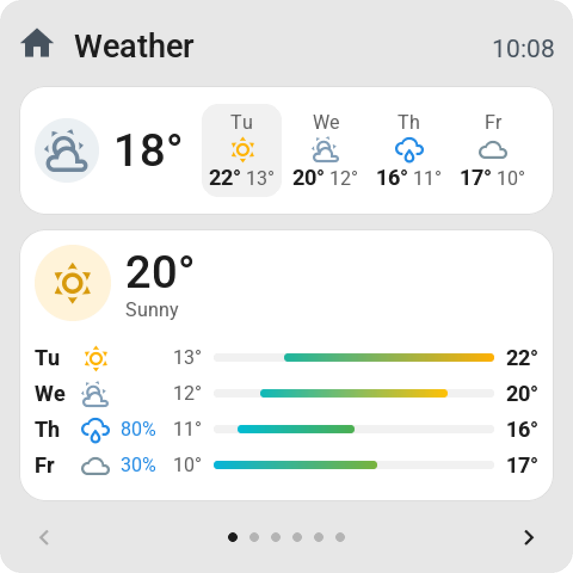
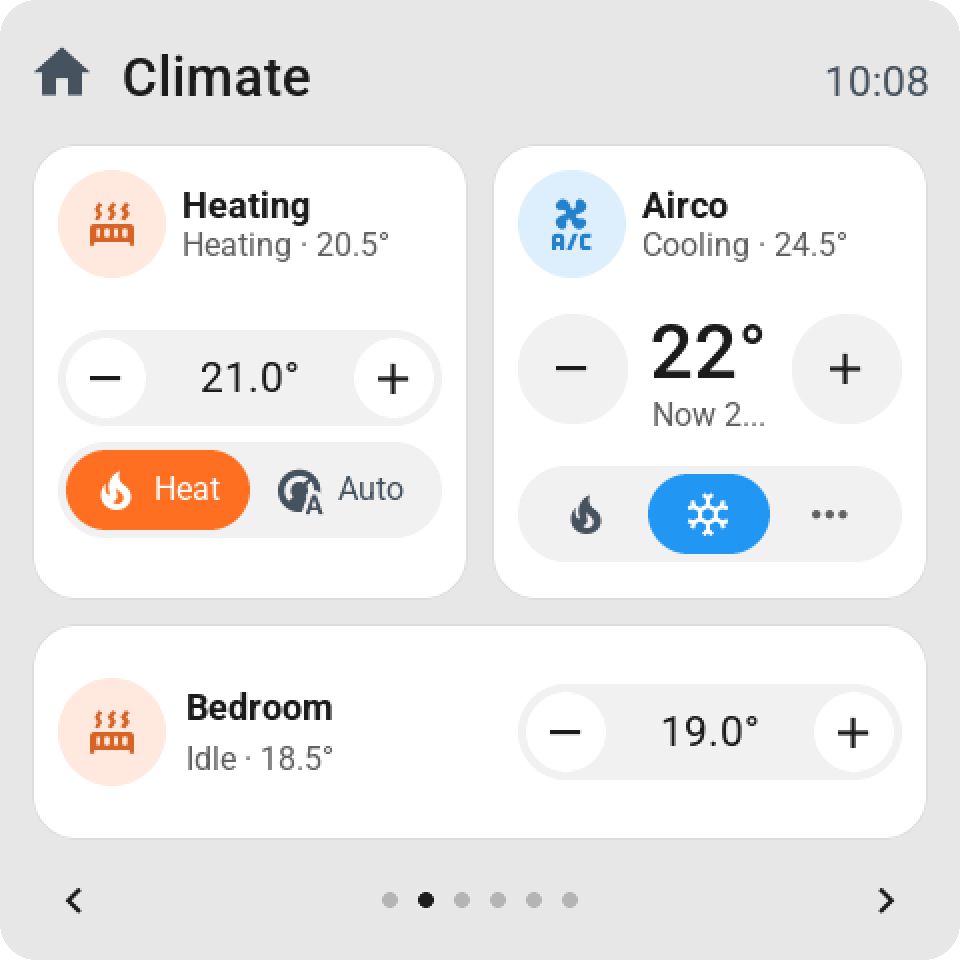
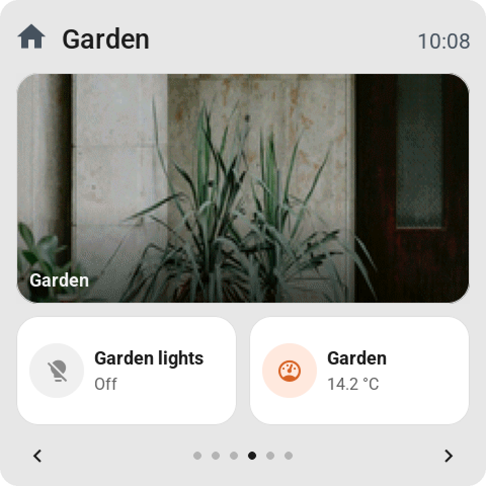
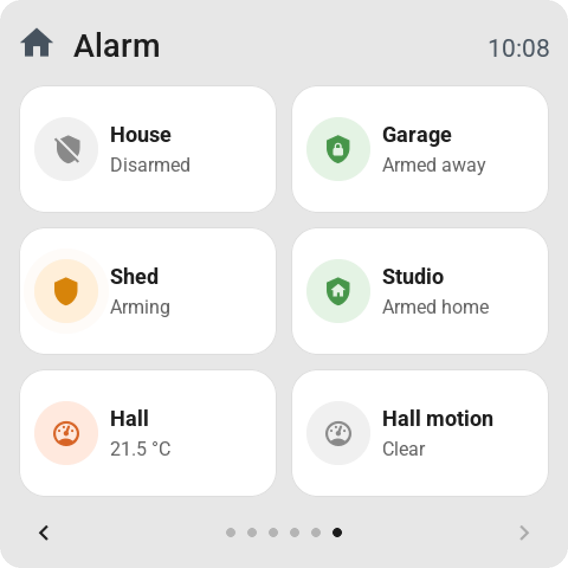
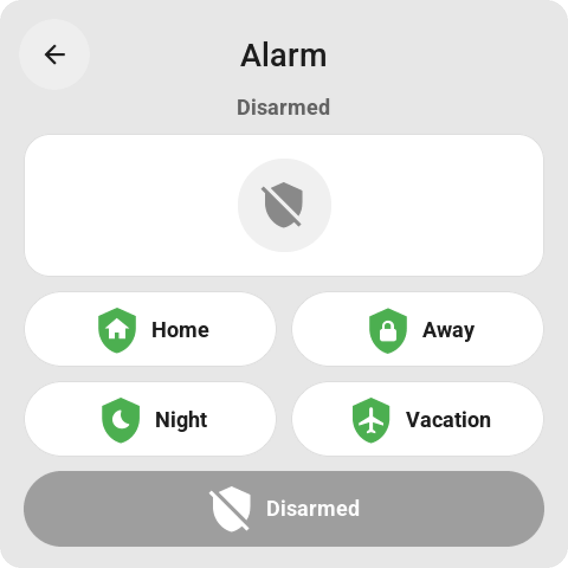
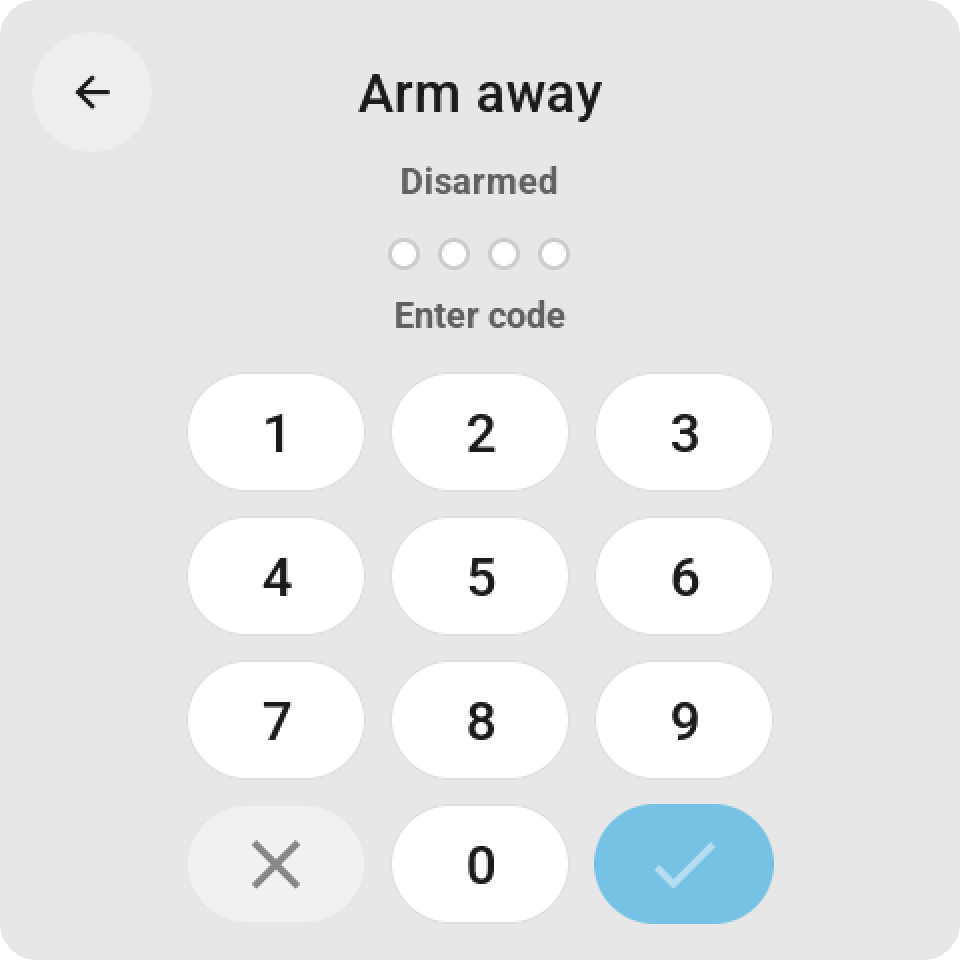
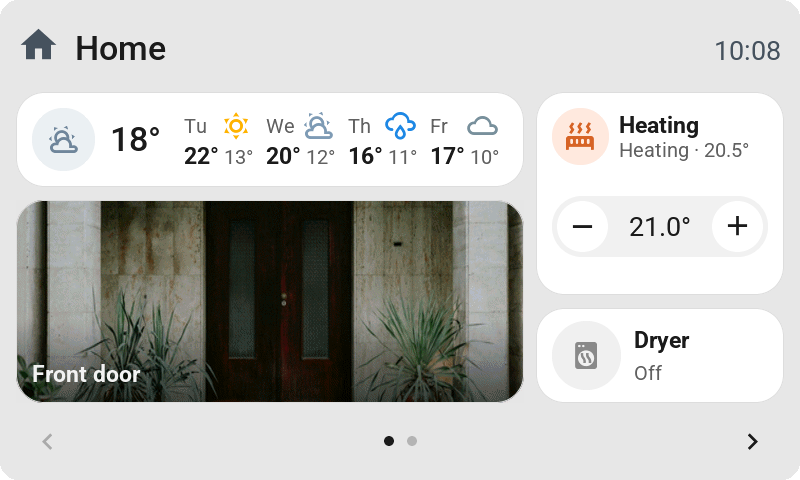
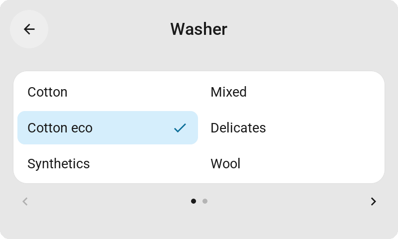

  

<h1 align="center">Tessera</h1>

<b>Touch screens for Home Assistant. A screen for every room, one simple editor.</b>

  <a href="https://tessera-maxgramser.on-forge.com"><b>Website</b></a> ·
  <a href="https://tessera-maxgramser.on-forge.com/docs/getting-started">Get started</a> ·
  <a href="https://tessera-maxgramser.on-forge.com/screens">Supported screens</a> ·
  <a href="https://tessera-maxgramser.on-forge.com/community">Community</a> ·
  <a href="https://tessera-maxgramser.on-forge.com/community/share?type=installation">My screen works</a>

Tessera is the new name for ESP Screens. In Home Assistant the app is still called ESP Screen Manager and its panel ESP Screens; the repository, the add-on and your screens stay exactly as they are.

Thank you! I work on this project with a lot of love, and every bit of support helps. I truly love the Home Assistant community.

  
  

**A touch screen for every room that you lay out yourself, and manage from Home Assistant. Incredibly easy to set up and to use.**

**Why.** Your phone is in the other room and a tablet on the wall is expensive. A small ESP32 touch
panel costs a fraction of that, sits on a table or in a wall box, and is always at hand for the
lights, the heating or the vacuum.

**What.** Firmware for affordable panels, five of them today, from the 2.8-inch CYD to the 10.1-inch Guition, with
tiles over up to eight pages, as many per page as the glass holds: lights, climate, blinds and curtains, the vacuum, media, the weather,
history graphs, clocks and timers, your alarm with its keypad, and on every screen but the CYD your cameras. A tile can take the whole page, one big switch you push without
looking, and a tile can go to another page. An automation can put an alert on every screen when someone rings
the bell, and a screen with room for pictures shows who is there with the doorbell camera's picture. A tap can run any
action Home Assistant has for a tile, and Dark mode suits a screen beside the bed.

**How.** ESP Screen Manager is an app inside Home Assistant. It flashes a new screen over USB, updates
it over Wi-Fi and sends it your tiles. Changing a screen is pick, drag and **Save & send**:
no reflash, no YAML to write, no blueprint, MQTT or token. Brightness, night hours and Dark mode can
also be changed on the screen or by an automation, and your own YAML for one screen survives every update.

**[Install it](#installing-from-home-assistant)** · [Website](https://tessera-maxgramser.on-forge.com) · [Pages and navigation](docs/PAGES.md) · [Full reference](README_EXTENDED.md) · [What's new](screen_manager/CHANGELOG.md)

## In real life

A Guition in the living room, 37 seconds in one take: tapping tiles, swiping through the pages,
opening cards and a history graph, while the lamp behind it goes from purple to orange.

https://github.com/user-attachments/assets/f9f6a933-d388-4c8b-9c9a-011dfa37617b

  
  
  

Real photos, not renders: the 4-inch Guition next to the lamp it controls.

## Five screens supported, 2.8 to 10.1 inch

One home, five panels. A screen is built for the glass it runs on: it measures its own canvas at boot and gives a page
the cells that board has, six tiles on the 2.8-inch CYD and twenty on the 10.1-inch Guition, while a tile stays about
the same size in millimetres. The same tiles, the same cards, the same editor; the bigger the glass, the more of your
home fits on one page.

  

To scale, each with the page it fills: the same home on the 2.8-inch CYD, the 4-inch Guition, the 4.3-inch and 7-inch Waveshare, and the 10.1-inch Guition. Rendered from the firmware's own code, one board at a time.

  
  
  

  
  

  

The same home standing up. Which way a screen hangs is chosen when it is built, and every board that is not square hangs either way, with a grid of its own: the 10.1-inch Guition 4 × 5 instead of 5 × 4, the 7-inch Waveshare 2 × 7 instead of 4 × 4. Which board is which, and what to look for when you buy one: <a href="#which-screen">Which screen</a>.

## Taller tiles, richer cards

  

  
  
  

  
  

A tile can be 1 × 2 or 2 × 2 cells as well as one cell, double width or the whole page, and the card follows the room it gets: a player shows its album cover behind the track (every screen but the CYD), the heating shows its setpoint and the modes Home Assistant lists for it (the last key opens the card when they do not all fit), a blind shows its position, and its slats where there is room, an on/off tile stands centred with its switch. Every board works out the same card from its own glass. Each page has its own title and top bar, any page can be Home, and a page can stay out of the page dots and be opened from a tile, with a Back key to return. Rendered from the firmware's own LVGL code with a demo home.

## Weather, heating, cameras and your alarm

  
  
  

  
  
  

  
  

The weather with the coming days, and on a bigger tile the whole week with a bar from each day's low to its high. A thermostat has its − / + and a bar with a key per mode; an airco shows heat and cool first and the rest behind "…". A live camera on a taller tile fills the card with its picture and its name, or shows the whole picture. Your alarm is a tile in Home Assistant's colours, with a key for every mode and Home Assistant's keypad when the panel asks for a code; someone coming in wakes every screen with the keypad to disarm. A select, such as a washing machine's programme, opens a list with a check at the one it is on. On every screen with the memory for it, every page is built ahead and kept, so the next one is there the moment you turn to it. Rendered from the firmware's own LVGL code with a demo home.

## On the screen

  
  
  

  
  
  

  
  
  

  
  
  

  
  
  

  
  
  

Tap a tile to switch it, hold it for the full card. Keys and sliders right on the tile, pastel colors, a clock, the weather and history you can read with a finger. A lamp with modes (a WLED) gets an effects page with a drum picker, named and filled from what Home Assistant lists for it. The media card shows what plays with its album cover, fetched by ESP Screens like a camera picture, and a media tile can show that cover in the icon's place (<a href="docs/CAMERA.md">how</a>). Rendered from the firmware's own LVGL code with a demo home.

  
  
  

Cameras are tiles too, not only part of an alert: any camera or snapshot in Home Assistant (a doorbell's last ring, for example) goes on a screen like any other tile. Tap it for the picture full screen, refreshed every four seconds, or let the tile itself show its live picture (Display → Live picture, every 15 or 30 s): in the icon's place, or on a taller tile over the whole card, filled or whole, with or without its name; an alert can carry the same picture. Every screen but the CYD, which has no memory for pictures (<a href="docs/CAMERA.md">how it works</a>).

  
  
  

  
  
  

  
  
  

The same cards on the 2.8-inch CYD, 320 × 240. The CYD has no memory for pictures: its media card shows the player's icon in the cover's place.

  
  
  

Dark mode, for a screen beside the bed: the same pages, darker. It is a switch on the screen, in ESP Screens and in Home Assistant, so an automation can turn it on at bedtime.

  
  
  

Settings on the screen itself: hold the top bar. The same brightness, Dark mode, standby, night hours, clock and rotation as in ESP Screens, and every one of them is an entity in Home Assistant.

## Managed from Home Assistant

  

ESP Screens, a page in Home Assistant: your screens on the left, the pages of the chosen screen in the middle with the values Home Assistant reports right now, the library on the right.

  
  

Search your home, drop a tile on the preview, tap it for its name, width, control and color, and for what a tap does: open its card, switch it, or run any action Home Assistant has for it, such as the curtains to 50 %. Save, and the screen has it. ⌘K searches screens, entities and actions; Identify blinks a screen so you know which one it is.

  
  

A top bar built from your own home, firmware updates over Wi-Fi (every night if you like), and a skill so Claude can rearrange your screens.

  

Screen settings apply at once, and a change made on the screen or by an automation shows up here too.

  

Other hardware on your board? A CYD with the other display controller is a choice in New screen, and for anything else every screen has an Override YAML of its own, checked by ESPHome before a build and kept through every update.

## In your language

  
  
  

The same home in German, French and Polish. The screens follow your Home Assistant: its language, its words for a light or a robot, and how your country writes a date, a time and a number — 75 % in German and French, 75% in Polish and English.

The screens, the editor and its messages speak **English (US and UK), Nederlands, Deutsch, Français, Italiano,
Español, Português and Polski**. Nothing to set up: ESP Screens takes the language of your Home Assistant.

  

Settings → Language & region, when you want something else than Home Assistant's own.

- **The editor** follows the language of your Home Assistant profile, so two people in one house each read their own.
- **A screen** carries one language, built into its firmware: change it and press **Update** on the screen (or let
  the nightly round do it). The clock (24 hours or 12 with AM/PM) and the number format change straight away, on
  every screen at once.
- **Words from Home Assistant stay Home Assistant's**: what a door, an airco or a robot says on a tile and in its
  card is the word its own dashboard shows, in your language.

Most languages still need someone who speaks them to read the texts through, and a new language is one file.
[Translating ESP Screens](docs/TRANSLATING.md) walks through both; a language without a file falls back to English
while it keeps your country's clock and numbers.

## Alerts

  
  

Someone at the door? One event in an automation wakes every screen and shows it. Add the doorbell camera and a Guition shows who is there; tap the picture, or a camera tile, for the camera full screen, refreshed every few seconds. <a href="docs/CAMERA.md">Camera images</a>.

  
  

Any alert, on one screen or all of them, in a pastel color of your choice, with one button or two to choose from, each in a color of its own and with its own action. <a href="README_EXTENDED.md#alert-from-an-automation">How alerts work</a>. An automation can also put a page in front, such as the page with the full-page player when the music starts: <a href="README_EXTENDED.md#open-a-page-from-an-automation">Open a page from an automation</a>.

## Installing from Home Assistant

### Which screen

| Screen | Resolution | Display / touch |
| --- | --- | --- |
| [CYD ESP32-2432S028](https://tessera-maxgramser.on-forge.com/screens/cyd) | 320 × 240, 2 × 3 tiles | ILI9341 / resistive XPT2046 |
| [Guition ESP32-S3-4848S040](https://tessera-maxgramser.on-forge.com/screens/guition), 4 inch | 480 × 480, 2 × 3 tiles | ST7701S RGB / capacitive GT911 |
| [Waveshare ESP32-S3-Touch-LCD-4.3](https://tessera-maxgramser.on-forge.com/screens/waveshare43) | 800 × 480, 3 × 3 tiles | ST7262 RGB / capacitive GT911 (backlight always on: no standby, no night) |
| [Waveshare ESP32-S3-Touch-LCD-7](https://tessera-maxgramser.on-forge.com/screens/waveshare7) (experimental) | 800 × 480, 4 × 4 tiles | RGB / capacitive GT911; backlight always on, hardware acceptance pending ([details](docs/WAVESHARE7.md)) |
| [Waveshare ESP32-S3-Touch-LCD-4B](https://tessera-maxgramser.on-forge.com/screens/waveshare4b), 4 inch (experimental) | 480 × 480, 2 × 3 tiles | ST7701S RGB / capacitive GT911; dimmable backlight, hardware acceptance pending ([details](docs/WAVESHARE4B.md)) |
| [Waveshare ESP32-S3-Touch-LCD-3.5](https://tessera-maxgramser.on-forge.com/screens/waveshare35) (new) | 480 × 320, 2 × 2 tiles | ST7796 SPI / capacitive FT6336; dimmable backlight, no camera pictures ([details](docs/WAVESHARE35.md)) |
| [Guition JC8012P4A1](https://tessera-maxgramser.on-forge.com/screens/jc8012p4a1), 10.1 inch | 1280 × 800, 5 × 4 tiles | MIPI-DSI JD9365 / capacitive GSL3680, ESP32-P4 (new) |
| Guition [JC1060P470](https://tessera-maxgramser.on-forge.com/screens/jc1060p470) and [JC1060P470 V2](https://tessera-maxgramser.on-forge.com/screens/jc1060p470v2), 7 inch (experimental) | 1024 × 600, 4 × 4 tiles | MIPI-DSI JD9165 / capacitive GT911, ESP32-P4; hardware acceptance pending ([details](docs/JC1060P470.md)) |

Each screen links to its page on the [Tessera website](https://tessera-maxgramser.on-forge.com/screens), with what owners report about it.

> **Got your screen working? Tell the next person.** Whether a board is worth buying is something
> only owners can tell. On the website, [My screen works](https://tessera-maxgramser.on-forge.com/community/share?type=installation)
> records your exact board, its firmware version and whether the display, touch and connection work,
> one report per account and board. It takes a minute (you sign in with GitHub), and it is how an
> experimental board becomes one people can buy with confidence. Something not right?
> [Report a problem](https://tessera-maxgramser.on-forge.com/community/share?type=issue) there, or open an issue here.

Use these exact board variants: similar-looking product names can have different
controllers or connectors. Wallbox relays are not controlled by default; a 4-inch Guition with relays
can switch them through its Override YAML ([docs/GUITION.md](docs/GUITION.md#relays)).

The one we use ourselves is the 4-inch Guition, and it has been good to us: bright,
responsive touch, and it has been on the wall for months without a hiccup. We buy it here:
[Guition ESP32-S3-4848S040 on AliExpress](https://nl.aliexpress.com/item/1005008506761923.html).
AliExpress being AliExpress, that link may go dead at some point. If it does, search for
"ESP32-S3-4848S040" and check the listing says 480 x 480, ST7701S and a capacitive GT911
touch panel before you order.

ESP Screens builds with its own **ESPHome 2026.9.0**. The firmware also builds in your own ESPHome Device Builder
with ESPHome 2026.6.2 or newer; the 10.1-inch Guition asks for 2026.8.0 or newer, because its touch panel is
newer than that.

The 10.1-inch Guition is **new in this release and has not yet been through our own acceptance test**: its
hardware was worked out and flashed on a real panel, and the screens' own software is the same on every board,
but the two have not stood on one desk together. Tell us how it goes. It needs a panel with pre-v3 silicon
(the boot log says `chip revision: v1.3` or another below v3.0), which is what these panels have shipped with
so far; rev3 silicon needs a firmware of its own.

### Do I need ESPHome?

**You don't need to install the separate ESPHome Device Builder app.**
ESP Screen Manager already includes the ESPHome CLI and can build firmware itself,
install it via USB or give you the file to put on the screen from your own computer,
and later update it wirelessly over OTA.

**You do need to pair the flashed screen via the ESPHome integration in HA.**
That pairing lives under **Settings → Devices & services**, not in the
App store. Add the discovered device there. If it doesn't appear automatically,
choose **Add integration → ESPHome** and enter the screen's IP address.
If asked for a key, use the `api.encryption.key` from your own device YAML,
and grant the device permission to perform Home Assistant actions.

| Component | Needed? | What for? |
| --- | --- | --- |
| ESP Screen Manager app | Yes, for this installation route | Installing firmware, managing tiles, and sending current data to the screen |
| ESPHome Device Builder app | No, optional | Alternative editor and firmware installer; the same CLI is already in ESP Screens |
| ESPHome integration in HA | Yes, pair every screen | The connection between Home Assistant and the physical screen |

So a fresh installation without ESPHome Device Builder also works. If there's
no ESPHome `secrets.yaml` yet, our wizard asks for Wi-Fi once and
stores it locally. Existing Wi-Fi secrets are reused. API and OTA keys
are generated per new screen and stay in that device's own profile.

### Step by step

For Home Assistant Container (Docker) without the App store, follow [ESP Screens with Docker](docs/DOCKER.md).

For Home Assistant OS with Apps/Add-ons on **aarch64 or amd64**:

1. Open the App store and add this repository:
   `https://github.com/MaxGramser/homeassistant_espscreen`.
2. Install **ESP Screen Manager**, start the app, and open **ESP Screens**.
   ESPHome Device Builder is optional: the ESPHome CLI is already in this app.
3. Connect the screen with a USB data cable to the **Home Assistant machine**
   and choose **New screen** in the sidebar: your board, which way it hangs, a name, the USB port, and
   **Install**. If Wi-Fi is missing from the ESPHome `secrets.yaml`, the window
   asks for it once and ESP Screens only adds the missing lines. The profile
   with unique API and OTA keys goes into the ESPHome folder; the build
   and flash run in the same window (a first build takes a few minutes on a
   Raspberry Pi). Each screen gets its own profile.
   Is Home Assistant on a server or in a virtual machine, out of reach of the screen?
   Choose **Download** under **Install via**: ESP Screens builds the firmware, and you put it
   on the screen from your own computer with [ESPHome Web](https://web.esphome.io) in Chrome
   or Edge. After that, updates go over Wi-Fi as usual.
4. **CYD:** go through the calibration on the screen. **Guition:** uses GT911
   without resistive calibration. Then pair the discovered ESPHome device in
   **Settings → Devices & services** using the API key the window
   shows after installation (copy button). Grant the device permission to
   perform Home Assistant actions.
5. Select the screen in ESP Screens, choose your tiles, and click
   **Save & send**. Then test the physical controls.

  
  

New screen (step 3) and choosing your tiles (step 5).

New firmware goes on over Wi-Fi with the **Update** button of a screen in ESP Screens, or by itself
every night if you turn that on under **Settings**; **Firmware & USB → Wi-Fi / OTA** in the sidebar
installs it by hand. For an existing screen, always use the existing profile; creating a new
installation profile generates new keys.

The [complete installation guide](docs/EASY_SETUP.md) walks through every step in more detail.

## More

- **[Full reference](README_EXTENDED.md):** every card and setting, alerts and wake/sleep from an
  automation, the top bar, the settings page on the screen, and how updates keep your settings.
- [Guition hardware, mounting, and rotation](docs/GUITION.md) ·
  [CYD calibration and USB diagnostics](docs/CALIBRATING.md) ·
  [Troubleshooting](docs/TROUBLESHOOTING.md) ·
  [Release history](screen_manager/CHANGELOG.md)

## Credits and license

The very first version started from Adrian Kuehlewind's
[ESPHome-touch-display-mount](https://github.com/akuehlewind/ESPHome-touch-display-mount).
Little of that code is left, but his repository has 3D-printable desk, under-desk, wall and flush
mounts for the CYD.

The front door in the camera pictures is a photo by
[Virginia Marinova](https://unsplash.com/photos/the-door-welcomes-with-plants-on-both-sides-80uwJgdeqWg) on Unsplash.

Tessera (formerly ESP Screens) is MIT licensed, see [LICENSE](LICENSE).
