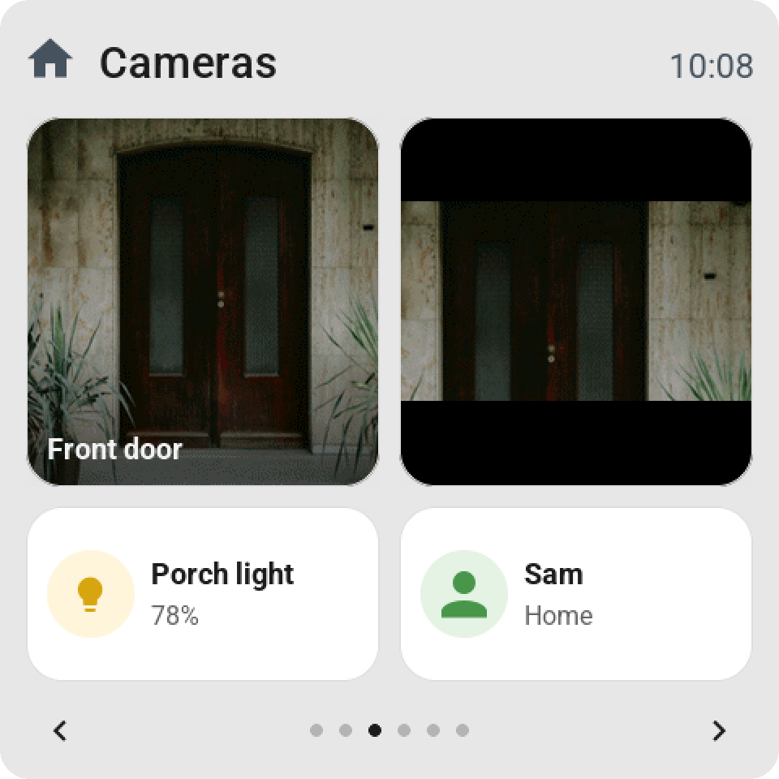
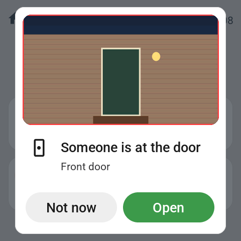
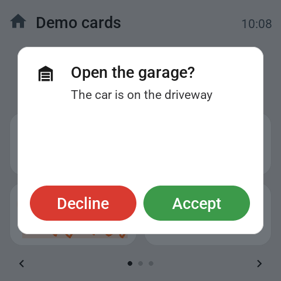

# Tessera: the full reference

<sub>Tessera is the new name for ESP Screens. Home Assistant still shows the app as ESP Screen Manager and its panel as ESP Screens, so this page uses those names. More on the [Tessera website](https://tessera-maxgramser.on-forge.com).</sub>

The [README](README.md) shows what ESP Screens is and how to install it. This page has the rest:
every card and setting, what an automation can do with a screen, the top bar, the settings page
on the screen itself, and how updates work.

- [What you can configure](#what-you-can-configure)
- [Alert from an automation](#alert-from-an-automation)
- [Wake and sleep from an automation](#wake-and-sleep-from-an-automation)
- [Customizing tiles and colors](#customizing-tiles-and-colors)
- [Top bar](#top-bar)
- [Settings on the screen](#settings-on-the-screen)
- [Updates and keeping your settings](#updates-and-keeping-your-settings)
- [Guides and installation help](#guides-and-installation-help)

## What you can configure

- **One tile per cell**, across up to eight fixed pages: six cells a page on a CYD, a 4-inch Guition or the
  [experimental Waveshare 4B](docs/WAVESHARE4B.md) (48 tiles), nine on
  the Waveshare 4.3-inch (63, over seven pages), twenty on the 10.1-inch Guition (60, over three), and sixteen on the
  [experimental Waveshare 7-inch](docs/WAVESHARE7.md) (64, over four), and four on the [Waveshare 3.5-inch](docs/WAVESHARE35.md) (32), lying down (firmware 0.2.62+; twenty tiles before).
  Search by entity, device, or room, and drag to reorder. A whole page moves the same way: drag it by its
  label to another place in the row, and its tiles, its own title and the Go to page tiles that lead to it come
  along. Remove page beside the cell count takes a page away with those same tiles, with Undo beside the message.
- **Per-tile settings:** a custom name, click behavior, a small slider where
  supported, or a large value for things like temperature and power usage.
  On a double-width tile the small slider stands beside the name, in the cell
  beside it, like the direct controls (firmware 0.2.81+; a strip under the name before).
  From firmware 0.2.13, the large value shows a small domain icon next to the
  title; a number that's too long is truncated with an ellipsis, the unit stays visible.
- **Pastel backgrounds per tile:** choose red for an all-off script,
  green for all-on, or any other color. The title and status stay dark and
  readable; in Dark mode the colour turns deep and the text light. The color also
  appears in the screen preview; **Default** restores
  the normal colors. Requires firmware 0.2.10 or newer. **None** drops the card
  entirely: the content then sits at the same size directly on the screen background
  (firmware 0.2.16).
- **Clock:** digital, analog, a simple dial or a flip clock (firmware 0.3.6). A new clock starts as the
  simple dial: a disc with four strokes and eight dots, dark on a light screen and light on a dark one,
  with the time and date beside it on a wide tile and under it on a tall tile or a full page. The flip
  clock shows hours and minutes on two blocks, stacked on a tall tile. With the 12-hour clock, AM or PM
  stands beside the time. The analog clock has a mark for every hour (numerals at 12, 3, 6, and 9 on
  the Guition). On a single tile it shows a calendar block next to the dial (weekday, day and month; the
  CYD the day and month); double-width shows the digital time with the date beside it, and a full-page
  clock is the dial alone. Both dials have a red second hand while the screen is awake.
- **Light control:** brightness, rainbow color, and white temperature according to
  the light's capabilities. Open the detailed control with a long touch.
- **Effects (firmware 0.2.70+):** a light that offers effects (a WLED, a Hue with
  its candle effect) gets a sparkles key at the top right of its colour card. It
  opens a page with a row per thing the lamp offers, named and ordered as Home
  Assistant lists them: the light's effect and the select entities of its device
  (a WLED's colour palette, preset and playlist), plus a slider per number entity
  (speed, intensity). A row opens a drum picker with every name Home Assistant has
  at that moment; the check at the top right sends the choice. While an effect
  runs, the tile names it instead of the brightness.
- **More cards:** climate, vacuum, fan, cover, media player, sensors,
  select/input_select, number/input_number, switches, scenes, scripts, and
  buttons.
- **Special cards (firmware 0.2.14+):** a **clock** (digital or analog)
  as a built-in tile, a **weather forecast** with five days on a
  double-width card, a **graph** of the sensor history in the tile,
  a **sun path** (`sun.sun`: horizon with the sun between sunrise and
  sunset), a **timer** (`timer.*`, tapping starts or pauses it), and
  **presence** (`person.*`). Pick them in the library like any other tile, or
  drag them straight into the screen mockup; **Double-width** is an option for every tile, and so is
  **Full page** (firmware 0.2.62+; not for a Go to page tile): the tile takes the whole page and is
  one big button, so a screen by the door switches the light when you push anywhere on it. It is white
  or its own pastel like every other tile, and its icon shows the state (firmware 0.2.77+; before that
  the whole tile took its state colour while on).
  Its small slider, direct controls or graph sit at the bottom of the page. A **Go to page** tile
  (`screen.page_1` to `screen.page_8`) opens another page: a full-page light switch on page 1, a menu on page 2.
  Under **Goes to page** the editor offers the pages the screen has and the next, empty one, where a new sub-page
  starts. From firmware 0.2.65 the same page tile may sit on several pages of a screen, such as a tile back to the
  menu on every sub-page; older firmware takes each page tile once.

<p align="center">
  
  
  
</p>
<p align="center">
  
  
  
</p>

- **Alarm panel** (app 0.3.8 / firmware 0.3.3): an `alarm_control_panel` entity is a tile like any other, in
  every size. It takes Home Assistant's colours and icons: grey while disarmed, green while armed, orange while it
  counts down to armed or waits for someone who just came in, red while it goes off. A tap opens its card with a
  key for every mode Home Assistant lists for that panel (home, away, night, vacation, custom bypass) and one to
  disarm. When the panel asks for a code, the card shows a keypad first, the way Home Assistant's own code dialog
  does: arming needs one only when the panel says so, and a default code stored with the entity in Home Assistant
  means the screen asks for none. Only number codes can be typed on the screen; a panel whose code has letters
  says so on its card.
  - **Animations** show what the alarm does: a ring closes around the shield when it arms, the circle beats slowly
    during the exit delay, fast during the entry delay and in Home Assistant's one-second rhythm while the alarm
    goes off, and the bell shakes. Where the integration reports how long a delay lasts (Alarmo's `delay`
    attribute), the ring and the tile count it down.
  - **Someone comes in:** when the panel goes to `pending` or `triggered`, every screen that has its tile wakes up
    and opens the card, with the keypad to disarm when a code is needed.
  - **The code stays private.** The screen sends it to Home Assistant with the action (`code`), exactly as Home
    Assistant's dialogs do, and forgets it right away. It never logs it, stores it or puts it in an event, and the
    app never sees it.
  - **Wrong codes.** Not every integration says so when a code is wrong: some refuse the action, others ignore it.
    The screen counts a code as wrong when Home Assistant refuses it or when the panel has not moved after ten
    seconds. Three wrong codes lock the keypad for 30 seconds, and every wrong code after that doubles the time, up
    to 15 minutes. The lock survives a restart, and a code that works resets the count. Each wrong code fires the
    event `esphome.screen_alarm_code_refused` with `entity_id`, `failures` and `locked` (seconds), so an automation
    can send a notification or take a camera snapshot.
- **Direct control on double-width tiles** (firmware 0.2.19+), like the rows in
  Home Assistant: temperature − / + or mode buttons (climate), a toggle (switch,
  light, fan), start/stop/dock (vacuum), open/stop/close or a
  position slider (cover), volume with mute or previous/play/next (media),
  − / + or a slider (numbers), previous/next (select), start/pause and
  cancel (timer), and a single button for scenes, scripts, and buttons. Configurable
  per tile; **None** keeps the regular card.
- **On tap** (app 0.2.67 / firmware 0.2.58): **Automatic**, **Open control**, **View only**,
  **On / off** for everything Home Assistant can toggle, covers included, or **Perform action**:
  any action Home Assistant has for the tile's entity, under Home Assistant's own names and with
  its fields, such as Set cover position at 50 %. Holding the tile still opens its card, and the
  tile settings only offer what Home Assistant supports for that entity.
- **Home Assistant's words and icons** (app 0.2.67 / firmware 0.2.58): a blind says Open or
  Closing, a speaker Playing and a door Open or Closed, a sensor shows the decimals Home Assistant
  shows, and a tile without an icon of its own gets the one Home Assistant shows, following its
  state.
- **Home Assistant's colours** (firmware 0.2.71+): a tile turns grey whenever Home Assistant calls
  its entity inactive, by the same rule its own cards use: a light, switch or fan that is off, an
  airco that is off (its tile then says Off), a closed blind, a docked robot, a player in standby,
  a paused timer. Otherwise it takes Home Assistant's colour for the state: an airco per mode, an
  alarm sensor red, a battery green, orange or red by its charge, the weather by its condition.
  Scenes, selects, numbers and sensors keep a colour of their own per kind.
- **Weather card** with current weather, the coming hours and days including chance of
  rain or millimeters; **climate card** with an on/off button, mode, fan, and swing settings.
  The target temperature sits big between − / + keys with one row of mode keys below; the
  Guition shows fan and swing right away on a card of their own, the CYD behind ···.
  A thermostat tile of two rows (firmware 0.3.3) has a − / + stepper and a mode bar with heat and
  cool first; a tap on its circle turns it on or off.
- **Weather tile** (firmware 0.3.3): the weather now in its colour, then the coming days with the
  high in bold, the low in grey and the chance of rain in blue when it matters; today stands on a pill.
  A tile of two rows lists the days under each other with the week's range as coloured bars.
- **Select card** (firmware 0.3.3): a select's options as a list with a check at the one it is on,
  in two columns on wide glass and over pages when there are more (up to 16).
- **Vacuum card** with the state, battery and charging, start and dock, and how the robot
  cleans: **vacuum, vacuum and mop, or mop only** for robots that offer a cleaning mode in
  Home Assistant (such as Roborock), then suction and water. Only the rows the chosen mode
  uses are shown (app 0.2.46 / firmware 0.2.39).
  Scenes, scripts, and buttons show when they last ran. A tile that waits longer than
  a moment on Home Assistant shows a small spinner over the tile (see below).
- **Cover card** for blinds, curtains, shutters, and garage doors, like Home Assistant's own:
  a tall position slider on which the blind hangs from the top, a tilt slider over slats for
  venetian blinds, open, stop, and close, and the battery of a battery-powered blind
  (such as Motionblinds). A cover shows only what it supports (app 0.2.58 / firmware 0.2.50).
- **Media card** like a phone's "now playing" (app 0.2.77 / firmware 0.2.64): the album cover, the
  title, artist and album, a progress bar with the elapsed and total time, previous, play or pause
  and next, and a volume row with mute. Keys the player doesn't offer are faded, and a player that is
  off shows a power key. A Guition fetches the cover through ESP Screens, like a camera picture
  ([docs/CAMERA.md](docs/CAMERA.md)); the CYD shows the player's icon in its place. A media tile of
  size **Full page** is the same card on the page, with the keys and the volume working on the tile.
- **Cameras** on a Guition (app 0.2.66 / firmware 0.2.57): a `camera.*` entity, or an `image.*` one such
  as a doorbell's last ring, is a tile like any other. A tap opens the picture full screen, refreshed every
  four seconds, with the round back key; standby and **Back to page 1** close it. The same camera can bring its
  picture to an alert ([With a camera picture](#with-a-camera-picture)). The CYD has no memory for pictures and
  the editor doesn't offer it camera tiles. How the picture travels: [docs/CAMERA.md](docs/CAMERA.md).
- **History card** for sensors, numbers, binary sensors, people, and switches, the way Home
  Assistant shows history: a line with an axis in round steps and clock times for numbers,
  with the highest and lowest moment, and a timeline with the time in each state for on/off,
  home and away, and a status. Choose **1 hour**, **24 hours**, or **1 week**; hold a finger on
  the graph to read the value and time of that moment at the top (app 0.2.59 / firmware 0.2.51).
- **Top bar per screen** (firmware 0.2.32+): the name on the left, up to six
  items of your choice on the right: the time, an analog clock, the date, or an
  entity from Home Assistant with an icon, such as temperature, humidity, power usage, a door
  (open/closed), the alarm, who's home, or when something or someone last
  changed ("5 min ago", "Yesterday"). See [Top bar](#top-bar).
- **Screen settings:** standby time, normal and dimmed brightness,
  night hours, **Dark mode** (firmware 0.2.54+), 24- or 12-hour clock, back to page 1 by itself
  and on standby, optional swiping between pages, **Page buttons** (firmware 0.2.69+): switched
  off, the bar under the tiles goes and the tiles take its room, and **Show home button**
  (firmware 0.2.100+): a house at the far left of the top bar that takes the screen back to page 1. Change them in ESP Screens, where
  they apply at once, or on the screen itself. With firmware 0.2.49+ the screen keeps them, and every one of them is also an
  entity in Home Assistant, so an automation can switch **Night mode** or **Auto standby**
  (firmware 0.2.41+), for example to keep a screen on while someone is home, turn **Dark mode**
  on at bedtime (firmware 0.2.54+), and
  wake a screen or put it to sleep with its **Wake** and **Sleep** buttons (firmware 0.2.45+).
  See [Wake and sleep](#wake-and-sleep-from-an-automation).
- **Settings on the screen itself** (firmware 0.2.44+): hold the top bar for about a
  second and a half and the screen opens its own settings page — brightness, night,
  the clock, back to page 1, swiping, the page buttons, the home button, rotation, and what this screen is
  (name, IP address, firmware, whether Home Assistant is connected, and Restart). Changes show up in ESP Screens
  within a second. See [Settings on the screen](#settings-on-the-screen).
- **Rotation:** every screen turns upside down (180°) from the management page, and a square
  screen (the Guition) a quarter turn as well: 0°, 90°, 180°, or 270°. Native LVGL rotation turns the
  display and touch together (firmware 0.2.80+; the Guition since 0.2.9).
- **Read current data** (the ··· menu of a screen): what Home Assistant reports for every tile right now,
  and how each tile is set. The same menu has **Identify**, which blinks the screen so you know which one
  it is (firmware 0.2.31+), **Copy layout from…** another screen, and **Export** and **Import** of a
  layout as JSON (app 0.2.73); nothing reaches the screen before **Save & send**.
- **Override YAML per screen** (app 0.2.61): your own ESPHome YAML for one screen, such as a slower display bus,
  kept through updates. A CYD with the other display controller (ST7789V) is a choice in **New screen** since app
  0.2.129. See
  [Updates and keeping your settings](#updates-and-keeping-your-settings).

<p align="center">
  
  
  
</p>
<p align="center">
  
  
  
</p>
<p align="center"><sub>What a tile can do: keys and sliders on double-width tiles, previous and next for a choice, large values, small sliders, pastel colors, a clock and a timer.</sub></p>
<p align="center">
  
  
  
</p>
<p align="center">
  
  
  
</p>
<p align="center">
  
  
  
</p>
<p align="center">
  
  
  
</p>
<p align="center">
  
  
  
</p>
<p align="center">
  
  
  
</p>

Features depend on the capabilities Home Assistant reports for an entity.
The app must keep running to keep the screens supplied with current data.

A short tap on a switch switches immediately; the off state gets a gray icon. A long press
opens its history card with the toggle at the top right (firmware 0.2.51+).
The tile shows the new state at once and Home Assistant's own report confirms it; a refusal
puts the old state back. A spinner only appears when Home Assistant takes longer than about
0.4 seconds, and no wait lasts longer than three (firmware 0.2.59+). Tiles with a mini-slider
keep their icon; on the CYD, the icon and text block are vertically centered.

## Alert from an automation

<p align="center">
  
  
</p>

Every screen has the action **`esphome.<screen>_show_alert`** (firmware 0.2.31+). It places
a card over the entire screen, wakes the screen, and keeps the backlight at normal
brightness until someone taps **OK**. In an automation:

```yaml
action: esphome.kitchen_screen_show_alert
data:
  title: "Someone is at the door"
  subtitle: "Door 3, back"
  icon: doorbell
  color: orange
  button_text: "Coming"
  timeout: 0
  flash: true
```

- **`title`** and **`subtitle`**: a single-line title (truncated with an ellipsis if too long) and an
  explanation that wraps across multiple lines. Empty is allowed; an empty title becomes "Notification".
- **`icon`**: a name from the tile picker, such as `doorbell`, `bell`, `alert-outline`,
  `lock`, `door-open`, `motion-sensor`, `smoke-detector`, `water-alert`, `mailbox`, `car`,
  or `account`. `mdi:doorbell` and the hex codepoint (`F12E6`) also work, as long as the glyph
  is included in the firmware. Unknown falls back to the warning triangle.
- **`color`**: `red`, `orange`, `yellow`, `green`, `mint`, `blue`, `purple`, `pink`, or
  `gray` — the same pastel shades as the tiles. Empty gives the white card.
- **`button_text`**: the text on the button; empty is "OK".
- **`timeout`**: seconds after which the card disappears on its own; `0` means it waits for the button,
  however long that takes. The button always closes the card immediately, even with a timeout. Standby and
  night mode wait as long as the card is showing.
- **`flash`**: `true` makes the backlight blink four times when the alert arrives.

In ESP Screens, **Alerts** in the sidebar opens a cheatsheet with the exact action name for each screen,
a ready-to-paste example, and all fields, icons, and colors. It starts with **Try it** (app 0.2.73): fill in
the same seven fields, choose one screen or all of them, and send a test alert.
Home Assistant asks for all seven fields; leave a field empty (`""`, `0`, `false`) if you
don't use it. A new alert replaces the current one. Every end is reported as the event
**`esphome.screen_alert`** with `action` (`ok`, `button2`, `timeout`, `replaced`, or `remote`), `title`,
`screen`, and the `device_id` that Home Assistant adds, so an automation can wait for OK.
**`esphome.<screen>_dismiss_alert`** clears the card remotely. With the event for every screen, the
button can also perform a Home Assistant action of your choice (below).

### All screens at once

From app 0.2.45, one event reaches every screen that is online, screens you add later included.
ESP Screen Manager passes it on to each screen's `show_alert` action. The fields are the same;
the ones you leave out stay empty:

```yaml
actions:
  - event: esp_screens_show_alert
    event_data:
      title: "Mail!"
      subtitle: "There is post in the mailbox"
      icon: mailbox
      color: orange
      timeout: 0
      flash: true
```

**`esp_screens_dismiss_alert`** clears the alert on every screen. The app has to be running
for these two events; the per-screen actions work without it.

### One screen through the event

From app 0.2.133, both events take **`screen`**: only the screens it names get the alert. That is
how one screen gets a camera picture or a button that does something (both below): the per-screen
action `esphome.<screen>_show_alert` cannot take those fields, because Home Assistant makes every
field of a device's action required, so adding one would break every automation that calls it.

```yaml
actions:
  - event: esp_screens_show_alert
    event_data:
      screen: hallway-screen
      title: "Someone is at the door"
      icon: doorbell
      color: orange
      camera: camera.front_door
```

- **What to fill in:** the screen's device name (`hallway-screen`), the name Home Assistant shows
  for it (`Hallway Screen`), or a room (`Hallway`), which reaches every screen in it. Case, spaces,
  dashes and underscores don't matter, so the `hallway_screen` of its action works too.
  **Alerts** in ESP Screens lists the value for every screen, ready to copy, and writes the example
  for the screen you choose.
- **Several screens:** give a list, such as `screen: [hallway-screen, kitchen-screen]`.
- **A name that matches no screen sends nothing,** so an alert meant for one screen never lands on
  all of them. The ESP Screen Manager log then names the screens it knows.
- `esp_screens_dismiss_alert` with `screen` clears the alert on those screens only.

### With a camera picture

<p align="center">
  
  
</p>

From app 0.2.66, the event takes one more field: **`camera`**, a `camera.*` or `image.*` entity.
Every screen but the CYD, with firmware 0.2.57+, shows that camera's picture of the moment on the
card; a tap on it opens the camera full screen over the alert, and Back returns to the alert. Since
firmware 0.2.103 the picture keeps the camera's own proportions: a wide camera across the top of the
card, a square or standing doorbell camera on the left of the words where the glass is wide and low
([details](docs/CAMERA.md)). The CYD, which has no memory for pictures, shows the same alert without it. The
per-screen actions have no `camera` field; for one screen, add `screen` to the event (above).

```yaml
actions:
  - event: esp_screens_show_alert
    event_data:
      title: "Someone is at the door"
      subtitle: "Front door"
      icon: doorbell
      color: orange
      button_text: "Coming"
      camera: camera.front_door
```

<p align="center">
  
</p>

A camera or image entity also works as a **tile** on a Guition: a tap opens it full screen, refreshed
every four seconds. From app 0.2.91 with firmware 0.2.77 a camera tile can show a **live picture** in
the icon's place: in the tile's settings choose **Display → Live picture** and a pace, every 15 or
30 seconds. The picture is a small square with the tile's rounded corners, the middle of the camera's
view, and it refreshes while that page is on the screen; a tap still opens the camera full screen. The
camera tiles of one page share one download, so six live tiles cost the screen no more than one.
On a 1 × 2 or 2 × 2 tile (app 0.3.8, firmware 0.3.3) the live picture fills the whole card, with the
camera's name at the bottom. The tile's settings choose **Fill the tile** or **Whole picture**, and
**Name** or **Nothing** on the picture.
A media player tile can show its **album cover** the same way (app 0.2.92, firmware 0.2.78):
**Display → Album cover** puts the cover of what plays in the icon's place, refreshed when the track
changes, with the tile's controls kept. How the image travels (port 8098 of the app, no token on the
screen) is in [docs/CAMERA.md](docs/CAMERA.md).

### With a button that does something

From app 0.2.91 the event takes an **`action`**: a Home Assistant action the app performs when the
button is pressed, on whichever screen, once per alert. **`data`** gives the action's fields. The
screen itself only reports the press (the `esphome.screen_alert` event it always sent), so this works
with every screen from firmware 0.2.31 and needs no update. A timeout, a new alert over it or
`esp_screens_dismiss_alert` leaves the action unperformed. The per-screen actions have no `action`
field; for one screen, add `screen` to the event.

```yaml
actions:
  - event: esp_screens_show_alert
    event_data:
      title: "Someone is at the gate"
      subtitle: "Open it?"
      icon: doorbell
      button_text: "Open"
      timeout: 120
      action: script.open_gate
  - event: esp_screens_show_alert
    event_data:
      title: "Lights are still on downstairs"
      button_text: "Turn off"
      action: light.turn_off
      data:
        entity_id: light.downstairs
        transition: 3
```

### Two buttons, and a color per button

<p align="center">
  
  
</p>

From app 0.3.8 with firmware 0.3.3 an alert can offer a choice. **`button2_text`** adds a second button
on the left of the first, and **`button2_action`** with **`button2_data`** is what it does, the way
`action` and `data` work for the first. **`button_color`** and **`button2_color`** give a button a full
color of its own, from the same names as `color` (`red`, `orange`, `yellow`, `green`, `mint`, `blue`,
`purple`, `pink`, `gray`), so a yes can be green and a no red. Empty keeps the dark first button and
the light second one. The first button is always on the right; which answer goes on which side is yours
to choose.

```yaml
actions:
  - event: esp_screens_show_alert
    event_data:
      title: "Someone is at the door"
      subtitle: "Front door camera"
      icon: doorbell
      button_text: "Open"
      button_color: green
      action: script.open_gate
      button2_text: "Not now"
      button2_color: red
      button2_action: script.doorbell_decline
```

Every one of these fields is optional in the event. A screen with older firmware shows the same alert
with its first button only, and the ESP Screen Manager log says which screens did. The second button
ends the alert as **`esphome.screen_alert`** with `action: button2`, so an automation that waits can
tell the two answers apart without the app. For one screen, add `screen` to the event, or call its own
action **`esphome.<screen>_show_alert_choice`**: the seven fields of `show_alert` plus `button_color`,
`button2_text` and `button2_color`. It is a separate action because Home Assistant makes every field
of an action required, so `show_alert` keeps its seven and no automation that calls it breaks.

### Ask Claude

Use Claude Code in Home Assistant? **Settings → Claude → Install for Claude Code** writes an
ESP Screens skill to `/homeassistant/.claude/skills/esp-screens`, so Claude knows the events, the
tile settings and every field, color and icon. Then ask, for example: "Put the vacuum on the living
room screen", "Give the living room lights a brightness slider and make that tile wide", "Move the
vacuum to page 1" or "Show an alert on all my screens when the mailbox is full." Claude reads what a
screen shows from `sensor.esp_screens_<screen>` and asks before it changes anything. **Download for
claude.ai** gives the same skill as a zip to upload in Claude under Customize → Skills. Nothing is
written until you press the button.

<p align="center">
  
</p>

## Wake and sleep from an automation

Every screen has two buttons in Home Assistant (firmware 0.2.45+). An automation presses them
with the `button.press` action:

- **`button.<screen>_wake`** lights the screen up: a screen in standby goes to its normal brightness
  (the second hand of an analog clock runs again), and the standby time starts counting again. On a
  screen that is already on, only the count starts again. Wake is not a touch: **Back to page 1** keeps
  counting from the last touch, so pressing Wake on every motion doesn't keep an open card or a later
  page up, and a screen whose time ran out during standby lights up on page 1 (firmware 0.2.56+).
- **`button.<screen>_sleep`** puts the screen in standby right away, the same as when the standby
  time runs out, and also works with **Auto standby** off. The screen stays in standby until someone
  taps it, **Wake** is pressed or an alert comes in; switching Auto standby off doesn't end it. An alert
  that is showing closes (reported as `remote`).

Neither button saves anything on the screen, so an automation may press them as often as it likes,
on every motion too. That is the difference with the **Auto standby** switch, which is a setting.
To reach several screens at once, list their buttons:

```yaml
actions:
  - action: button.press
    target:
      entity_id:
        - button.kitchen_screen_sleep
        - button.living_room_screen_sleep
```

Don't target an area or a device with `button.press`: that presses every other button there too,
the Wake and Sleep of the same screen included.

## Open a page from an automation

Every screen has the action **`esphome.<screen>_show_page`** (firmware 0.2.87+). It puts one page of the
screen's tiles in front, the way a **Go to page** tile does when someone taps it: the screen wakes if it
was in standby, an open card or the settings page closes, and that page is shown. `page` is the number the
editor shows, 1 for the first page; a number past the last page opens the last page.

```yaml
action: esphome.living_room_screen_show_page
data:
  page: 4
```

Put a full-page player on page 4 and let an automation call this when the player starts an album, or open
the page with the camera tile when the doorbell rings. Like a touch, it starts **Back to page 1** counting
from that moment, so the screen goes back to page 1 on its own time (Settings → Screen on the panel, or
`switch.<screen>_back_to_page_1`) unless that is off; call the action again to keep the page up. An alert
that is showing stays in front. Nothing is saved on the screen, so an automation may call it as often as it
likes. The Claude skill (Settings → Claude) explains it too, so you can ask Claude for the automation.

## Customizing tiles and colors

Click a tile in the screen preview and its settings open in a drawer beside it. Under
**Pastel background**, choose a color, such as red or green. Optionally adjust the name, the
size, what a tap does (**On tap**), the small slider, or a large value. Click **Save & send**
to apply the changes.
After the first supporting firmware update, this requires no new flash.

<p align="center">
  
  
</p>
<p align="center"><sub>The settings of the Curtains tile, and that tile on the screen: open, stop and close on the tile, and a tap on its name sets the curtains to 50 %.</sub></p>

A color is a fixed choice for that tile: it stays red, for example,
even when you run the all-off script. The entity status and action feedback
stay separately visible.

## Top bar

Tap the top bar of any page in the editor's preview and the drawer shows the screen's **Top bar**:
the name on the left, up to six items on the right. **＋ Add** offers the time, an analog clock,
and the date (which
keep ticking on the screen itself, even without Home Assistant), suggestions from your own
home (temperature and power usage from the screen's room, the weather, how many people are home,
sunrise and sunset), and a search field for any entity, including a phone
(`device_tracker`), a lock, the alarm panel, or `zone.home`. Drag the items
to change their order; tap one to configure it:

- **What to show:** the state as Home Assistant writes it (21.3 °C, 65%,
  1,249 W, Open/Closed, Home/Away, Armed away), or **Last changed**: "Just now",
  "5 min ago", "Yesterday". A timestamp sensor can also count forward ("In 2 hours").
- **Icon:** automatic, matching Home Assistant (an open door gets an open-
  door icon), a custom icon from the list, or no icon.
- **Show:** always, or **only when active**: the item only appears when it's
  on, open, home, or greater than 0. Handy for an open door or a running
  washing machine. Active items are colored like in Home Assistant (open door amber,
  alarm armed green, alarm triggered red).

<p align="center">
  
  
</p>

The screen preview draws the bar with the same letters and rules as the screen:
all values on one line with the name, icons aligned to digit height, equal spacing.
If not everything fits next to the name, the name gets an ellipsis and the screen drops the
leading items; the editor marks those with dashes. Until updated, older firmware shows
only the name and the time (if that's in the bar).

## Settings on the screen

Everything you would want to change while standing in front of the panel is on the screen
itself (firmware 0.2.44+). Tiles, the top bar and the pages stay in ESP Screens, where you
have a mouse.

**Opening it:** hold the top bar — the strip with the screen's name and the clock — until the
blue line along the top edge is full, about a second and a half. Letting go early cancels.
Rather have a button? Put the built-in **Settings** card on a page like any other tile. From
Home Assistant, `esphome.<screen>_open_settings` opens it too (`page` 0 menu, 1 Brightness,
2 Night, 3 Screen, 4 This screen, -1 closes it).

| Group | What is on it |
|---|---|
| Brightness | Brightness, Dark mode, Auto standby, Standby after, Standby brightness |
| Night | Night mode, Starts, Ends, Night brightness |
| Screen | Back to page 1 by itself and after how long, also on standby, swiping between pages, page buttons, the home button, rotation (boards that turn) |
| This screen | Name, IP address, firmware version, Home Assistant connected, Restart |

The language, the 12 or 24-hour clock and how numbers are written are the same on every screen: Settings → Language &
region in ESP Screens (app 0.2.90, firmware 0.2.76). They follow Home Assistant's language unless you choose otherwise.
ESP Screens writes the language into each screen's YAML (`LANGUAGE: "nl"` under `substitutions:`), and the screen shows
it after its next firmware update. A screen whose YAML ESP Screens can't reach, such as one you build with ESPHome on
another machine, gets that line from you: a code from [`screen_manager/translations`](screen_manager/translations);
English is the default. [Translating ESP Screens](docs/TRANSLATING.md) says how to add or check a language.

<p align="center">
  
  
  
</p>

Tap a toggle to flip it, `-` and `+` to change a number or a time — hold them and a time walks
whole hours — and tap a chip like the clock to cycle it. Every change is saved on the screen,
takes effect at once, and appears in ESP Screens within a second, so both sides always show
the same value. The **Screen settings** cards in ESP Screens have the same rows.

<p align="center">
  
</p>

**In Home Assistant** (firmware 0.2.49+), every setting is an entity on the screen's device, under
*Configuration*: `number.<screen>_normal_brightness`, `switch.<screen>_night_mode`,
`time.<screen>_night_starts`, `switch.<screen>_dark_mode`, `select.<screen>_rotation` on a
Guition, and the rest. An automation, the settings page and ESP Screens all change the same value,
and setting a value the screen already has costs nothing. The full list is in
[docs/SETTINGS.md](docs/SETTINGS.md#who-owns-a-setting).

## Updates and keeping your settings

| Change | Action |
| --- | --- |
| Tiles, names, colors, or order | Save in ESP Screens; no firmware flash |
| Screen settings | Change them in ESP Screens (they apply at once), on the screen, or on their entities in Home Assistant |
| New version of the management page | Update ESP Screen Manager in the HA App store |
| New feature on the physical screen | The **Update** button on the screen (badge *Update x.y.z*), or **Update automatically every night** under Settings |
| Your own YAML for one screen | **Override YAML** in ESP Screens; kept through updates (app 0.2.61) |

Every app version belongs to one firmware version. After an app update, the list
shows per screen whether newer firmware is available. **Update** builds that screen's own profile
with the built-in CLI, installs it wirelessly, and waits until the screen is back.
With the checkbox enabled, that happens automatically at night, one screen at a time; a
failure stops the round and posts a notification in Home Assistant. Firmware
0.2.17+ reports its own device name and IP address for this; an older screen asks
for the IP address once. You can still do it manually via **Firmware & USB** in the sidebar → **Wi-Fi / OTA**.

The device's own YAML and Wi-Fi/API/OTA settings stay in the ESPHome config folder.
Tile layouts and options live in the app's persistent data. CYD calibration and
screen preferences stay stored on the device. Updates don't replace this
user data. Do still make normal Home Assistant backups and keep your
device profiles; removing an app or wiping flash memory is not an update.

**Your own YAML for one screen (app 0.2.61).** **Override YAML** in ESP Screens edits a small
`<screen>.local.yaml` beside the screen's profile, for hardware-specific changes such as a slower
display bus (a CYD's other display controller is a choice in **New screen** since app 0.2.129). It is loaded after the shared board package and stays in place when the app or
the firmware package updates. The screen's name, Wi-Fi, API, OTA, packages, external components and
captive portal stay managed and are refused there. **Save & check** runs ESPHome's full validation
of the complete profile, and a build never starts from an invalid one.

<p align="center">
  
</p>

**Efficient, even with many screens (0.2.39 / firmware 0.2.33).** The app sends a
screen only the tile that changed, as a single action
(`esphome.<device_name>_screen_message`) instead of chunks in a text field.
Every two minutes, a small ping follows with the layout revision; if the
screen reports that it doesn't match (after a restart, for example), everything is resent.
Firmware 0.2.49+ answers that ping, and a new layout, directly, so a screen that still
lacks a tile gets it again after 30 seconds instead of two minutes.
Graphs on sensor tiles come from Home Assistant's statistics, in one
query for all screens. Older firmware still works via the text field and the
full resend every two minutes. The diagnostic sensor `Uptime` has been
replaced by the `Last boot` timestamp.

See the [release history](screen_manager/CHANGELOG.md) and
[releases and protocol compatibility](docs/RELEASING.md).

**If you publish your own fork:** every push to GitHub is a release. Always also
bump the add-on version in `screen_manager/config.yaml` and log the change in
the CHANGELOG, otherwise the HA App store won't offer an update. A change to the
screen also gets a new `SCREEN_FIRMWARE_VERSION` in `packages/core.yaml`, the one place both boards
take it from, and the same `FIRMWARE_VERSION` in `screen_manager/app/core.py`.

## Guides and installation help

- [Complete installation from ESP Screens](docs/EASY_SETUP.md)
- [ESP Screens with Home Assistant Container (Docker)](docs/DOCKER.md)
- [Guition hardware, mounting, and rotation](docs/GUITION.md)
- [CYD calibration and USB diagnostics](docs/CALIBRATING.md)
- [Camera images and album covers](docs/CAMERA.md)
- [Troubleshooting](docs/TROUBLESHOOTING.md)
- [Instructions for developers and LLMs](AGENTS.md), with [how a screen's YAML is put together](docs/PROFILES.md),
  [settings](docs/SETTINGS.md), [colours and Dark mode](docs/THEME.md) and [releases](docs/RELEASING.md)

Give a developer or LLM a clean copy of this repository and, for example:

> Read AGENTS.md, README.md, and docs/EASY_SETUP.md. Help me install this CYD or
> Guition screen via USB on my Home Assistant. Identify
> the board and use my existing profile if one already exists. Guide me through
> calibration, HA pairing, tile selection, and physical tests. Keep keys local,
> and state which checks were actually carried out.

A successful build doesn't prove the physical touch or panel image is correct. The owner
must check the display and perform the requested taps.
