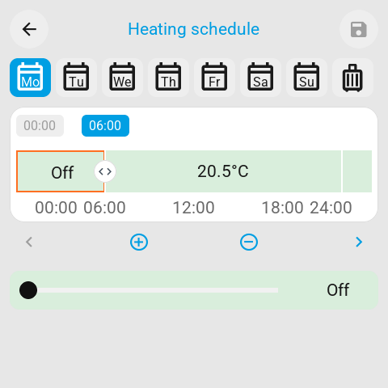
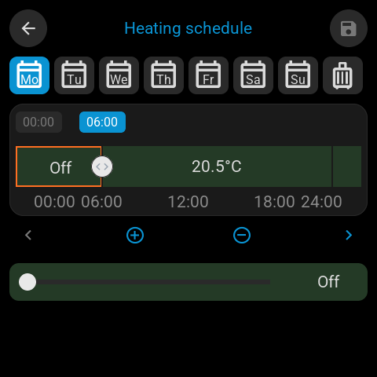

# Heating schedule

A climate tile can open a daily heating timeline on the screen. Home Assistant's
built-in Schedule helpers store and run the programme. No custom integration,
HACS package, calendar or dashboard card is required.

<p>
  
  
</p>

These captures come from the real LVGL firmware in ESPHome's host renderer, using
the upstream Waveshare ESP32-S3-Touch-LCD-4B profile at 480×480 with a green tile
background and example schedule. They are not photos of a physical device or
renders of the P4 720×720 model. The controls adapt to the board's display size.

## Set up

For a new installation, first follow [Easy setup](EASY_SETUP.md) to install ESP
Screen Manager and pair the screen with Home Assistant. The steps below require
an add-on and firmware build that include this feature; an unmerged development
branch is not delivered by the normal upstream update channel.

1. Update ESP Screen Manager and the screen to firmware 0.7.0 or newer.
2. Add your thermostat's climate entity to the screen. In its controls, choose
   **Tap action → Heating schedule**. Use the thermostat, not its relay switch.
3. Download the heating controller YAML using the link beside that option.
4. Enable packages in Home Assistant's `configuration.yaml`, merging this into
   the existing `homeassistant` section if there is one:

   ```yaml
   homeassistant:
     packages: !include_dir_named packages
   ```

5. Put the downloaded file in Home Assistant's `config/packages` directory.
   Check the configuration and restart Home Assistant. This standard YAML package
   provides a Vacation toggle, an apply script and an automation. It does not
   install Python code in Home Assistant.
6. Open the tile, edit a day and Save. The first save creates two native Schedule
   helpers: the weekly programme and Vacation. Opening the editor creates nothing.
   Supporting entities are initially hidden from automatic dashboards; no cards
   are added. They remain available in **Settings → Devices & services → Helpers**.

The adapter is part of ESP Screen Manager. It uses the add-on's existing Home
Assistant connection to read and update helpers. That connection must be allowed
to manage helpers. Package identifiers are derived from the thermostat entity ID;
download a new package if that entity is renamed. Keep the generated script,
automation and helper IDs unchanged.

## On the screen

The seven calendar buttons open each weekday's own programme. Select an interval,
adjust its temperature and drag its boundary handles in five-minute steps. The
circled plus and minus split or merge intervals. The short time labels are
indicators. The slider has a distinct Off position followed by the thermostat's
valid Celsius temperatures, up to 30 °C.

Save is the disk icon at the top right. Edits remain a draft until Save succeeds;
the manager reads back the helper to confirm the write. Back offers Save and leave,
Discard or Keep editing. A failed save retains the draft. An unconfigured day is
Off. Saving one day preserves the other weekdays.

Vacation is the eighth button. Its timeline repeats every day and overrides the
weekdays while enabled. Tap it again and save to disable Vacation and resume the
current weekday immediately. The weekday programmes remain stored while Vacation
is active.

The editor follows the screen's Light/Dark setting and the climate tile's chosen
background. Drawing and touch handling use the shared LVGL firmware. Small
displays divide the controls across three pages; no resolution or grid is fixed.

## Editing in Home Assistant

Open the weekly Schedule helper in Helpers. Each block's **Additional data** needs
only a numeric temperature, for example:

```yaml
temperature: 20
```

`temperature: 0`, an empty Additional data field, `mode: off`, or a gap means HVAC
Off. Zero is never sent as a thermostat setpoint. The helper being On means a
block is active, not that the heater is running.

The panel shows gaps as Off intervals. Saving a different interval leaves those
gaps and unchanged blocks intact in Home Assistant. Weekdays can be edited
independently, even if they previously shared the same programme. For Vacation,
keep an identical timeline on all seven days of its helper.

Reopen the panel to load changes made in Home Assistant. A stale panel save is
rejected, preserving its draft. Home Assistant's own helper editor does not check
the panel's revision: saving an old HA form can overwrite a newer panel edit.
Reopen that form before editing and avoid editing the same helper simultaneously.
The helper API also has no conditional update, so a narrow race remains between
the manager's last read and its write.

## Execution and limits

Home Assistant runs the timers, including transitions between adjacent blocks,
and reapplies the current programme after HA starts or the thermostat recovers.
The screen and manager can disconnect after saving. There is no scheduler clock
in the add-on. The controller checks Vacation when it executes, so a queued
weekday transition cannot bypass the override. Manual thermostat controls remain
available; the controller does not continuously undo them.

The editor supports Celsius Off/Heat thermostats, five-minute boundaries, at most
16 intervals per day including gaps, seven weekdays and one Vacation timeline.
Unsupported data is read-only with an explanation rather than silently removed.
Date-specific, solar and conditional events and bulk copying between days are not
part of this editor. The native end-of-day time is `24:00:00`.

A Vacation save updates its helper and toggle through separate HA calls. A partial
failure is reported as unconfirmed; reload before retrying. An API acknowledgement
confirms current HA state, not a guarantee of immediate disk persistence.

This feature does not add connection-loss heater protection. Relay wiring,
watchdogs and physical thermostat safety remain separate from the scheduler.

## Development

`schedule_model.h` owns typed intervals and draft state; `schedule_layout.h` owns
responsive geometry; `schedule_editor.h` owns the LVGL controls. Heating is the
only value profile currently exposed. The Python adapter maps this contract to
native helpers and `heating_package.py` generates the standard HA controller.

Requests use `esphome.screen_schedule` and the existing session/revision-scoped
page transport. They are restricted to climate entities assigned the schedule
tap action. Atomic snapshot assembly and bounded packets keep partial transfers
from replacing a draft. Old firmware is gated by version and capability.

Run `tools/check.sh` and `tools/check.sh --firmware`. With this change
and ESPHome 2026.9.0, CYD uses 1,674,400 bytes (91.2% of its
OTA slot) and Hosyond uses 1,680,832 bytes (91.6%). Compared with stock upstream
app 0.4.8 (`05ee2be`), CYD grows by 24,464 bytes, from 1,649,936 to 1,674,400.
That enters the project's tight flash-budget band. The increase needs a matching
saving or maintainer approval before a general release.

Software checks do not replace
physical touch or relay acceptance. Clean HA OS/Supervisor permissions and a full
DST clock-transition test still need acceptance testing.
