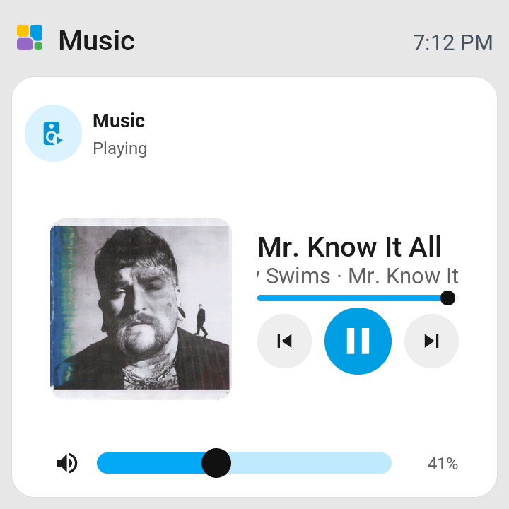
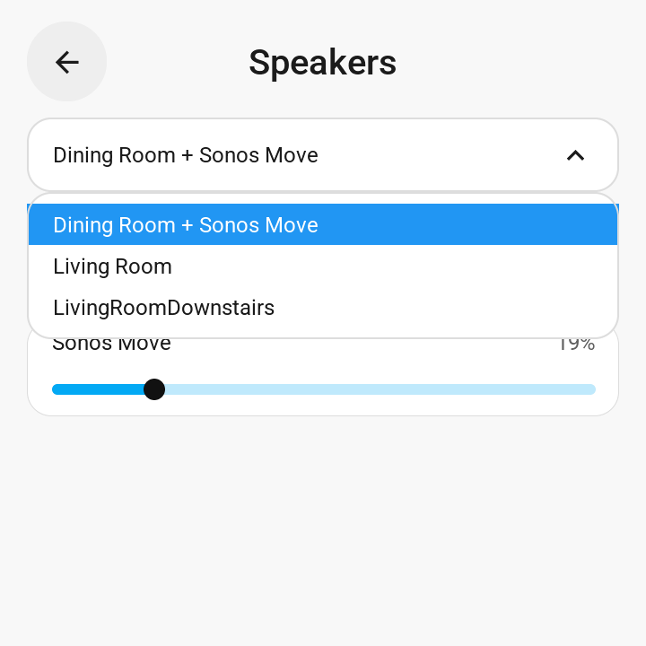

# Media player controls

The media card uses the Home Assistant entity selected in the tile editor. Sonos
is configured through Home Assistant's built-in Sonos integration. Music service
accounts remain configured in Sonos.

## Set up a new installation

1. Install ESP Screen Manager and pair the screen following [Easy Setup](EASY_SETUP.md).
   Both the manager and the physical screen's firmware must include these media
   controls. Updating the manager alone does not add them to older screen firmware.
   For a development-branch trial, build the screen from that branch too. The
   browser preview already includes the renderer shipped with its manager build.
2. Add **Sonos** under **Settings → Devices & services → Add integration** in
   Home Assistant, or accept its discovered entry. Enable UPnP in the Sonos app
   if required by the [Sonos integration](https://www.home-assistant.io/integrations/sonos/).
   Configure the Spotify account in the Sonos app and start music on the intended
   speaker or group. Check that its Home Assistant media-player controls work.
3. In the panel editor, add that **Sonos speaker's `media_player` entity**. For a
   group, use its coordinator, the first entity in its `group_members` attribute.
   The Spotify-account entity is a different control target and does not supply
   the Sonos speaker-group controls. Tap a normal tile to open the player, or use
   **Full page** to keep the player visible.
4. For a physical screen, open its ESPHome integration's **Configure** dialog and
   enable **Allow the device to perform Home Assistant actions**. This also permits
   the speaker-list request. See [ESPHome's action permission](https://esphome.io/components/api/#actions).
   For a browser preview, enable **Taps control devices** when you want its controls
   to send commands.

**Create and change speaker groups in the Sonos app.** Home Assistant reports
their current membership, and the manager lists those groups and speaker names
automatically. Groups changed through Home Assistant's standard grouping actions
also appear. These are the current Sonos groups, not named presets saved by the
panel. Its dropdown selects a group to inspect; it does not create a group,
transfer playback or change the tile's playback target.

For this Sonos-backed player, no Spotify developer key, separate Home Assistant
Spotify integration, HACS component, helper, automation or custom script is
required. The panel controls existing playback; it does not provide a Spotify
catalogue browser or create an initial queue. The manager and bundled preview run
on the user's Home Assistant installation without a development computer.

### Network and board requirements

Home Assistant and the Sonos speakers need working local network connectivity.
For prompt updates, speakers must reach Home Assistant's event listener, normally
TCP 1400. Container, NAT or VLAN installations may need network configuration;
follow the official [Sonos network requirements](https://www.home-assistant.io/integrations/sonos/#network-requirements)
and its advanced configuration guidance. These are Home Assistant/Sonos settings,
not panel-specific settings.

On physical screens, album art uses the manager's existing image server, normally
TCP 8098. It must be reachable from the screen. Pictures also require a board
profile that supports them; the CYD, Waveshare 3.5-inch and Hosyond 4-inch profiles
do not. See [camera and album-cover transport](CAMERA.md). The browser preview
loads its pictures through Home Assistant ingress.

## Use the controls

- Tap the speaker icon to mute or unmute the player's current group. Each
  speaker keeps its own volume setting. Ungrouped players target themselves.
- Hold the speaker icon to open **Speakers**. This is offered for media players
  that advertise Home Assistant's grouping capability. The manager also checks
  for the `group_members` attribute.
- Use the standard LVGL dropdown to view current groups from the same
  integration. A player on its own appears as a group of one. These are live
  groups, not saved presets. The list scrolls when needed and collects up to
  64 groups. Selecting one only changes which speaker volumes the window
  displays; it does not move playback or regroup speakers.
- Drag an individual slider to adjust that speaker. The command is sent on
  release, and the value is confirmed by Home Assistant. Group membership and
  volumes refresh every two seconds while the view is open. Controls become
  unavailable if no fresh reply arrives within seven seconds.
- Tap or drag the track timeline to seek when the player advertises Home
  Assistant's seek capability and supplies a duration. The panel sends one
  `media_player.media_seek` action on release. Players without seek support
  retain a progress indicator. A track change during a drag cancels the command.
- Tap loaded album art to view it full screen, then tap again to return. The
  picture fits the display without stretching or rounded corners. The panel
  requests a separate image from the original Home Assistant artwork, sized to
  its display, up to 1024 pixels per side. A 720 × 720 panel requests 720 × 720.
  Final detail depends on the artwork resolution supplied by the music service.
  The current view stays visible until the full image is ready. While full
  screen is open, track changes replace the artwork after downloading it,
  without a loading screen or an enlarged thumbnail.

Playback position follows Home Assistant's latest position and timestamp. It
advances locally between updates. After an accepted panel seek, the firmware advances
from the requested position until new playback data arrives. A refusal or missing
command response clears that estimate; the read-only preview also clears it.
Seeks from another controller appear when
the integration reports them; the panel cannot detect a position change that
Home Assistant has not received. Some Spotify Connect seeks on Sonos do not
immediately update the Sonos entity in Home Assistant.

Both views are drawn by the shared LVGL firmware. The WebAssembly preview uses
the same code and routes its ESPHome requests through the manager. No separate
browser player or Sonos plugin is required.
Enable **Taps control devices** in the preview to send playback, mute or volume
commands to Home Assistant. The default preview only displays live data.

## Screenshots

720 × 720 captures from the firmware preview with live Home Assistant playback:
the player, full-screen album art, and the current Sonos group selector.

  
  
  

## Transport and compatibility

Speaker data is requested with the `esphome.screen_media_groups` event and
`schema: "1"`. Only the requesting screen receives the `media_groups` reply.
Replies use the existing session, layout revision and view-counter checks, with
at most four group names and four speaker rows per packet. Group names are
collected into one dropdown; longer speaker lists have pages. No speaker data
is added to the tile layout format; older firmware never
requests this extension. A new firmware with an older manager times out with
unavailable controls, while ordinary playback controls continue to work.

Group mute uses ESPHome's standard Home Assistant data template. Home Assistant
resolves `group_members` when the command arrives. Individual volume changes use
the standard `media_player.volume_set` action.
