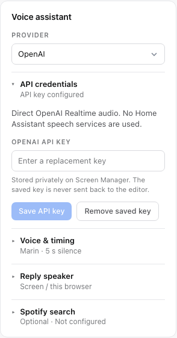
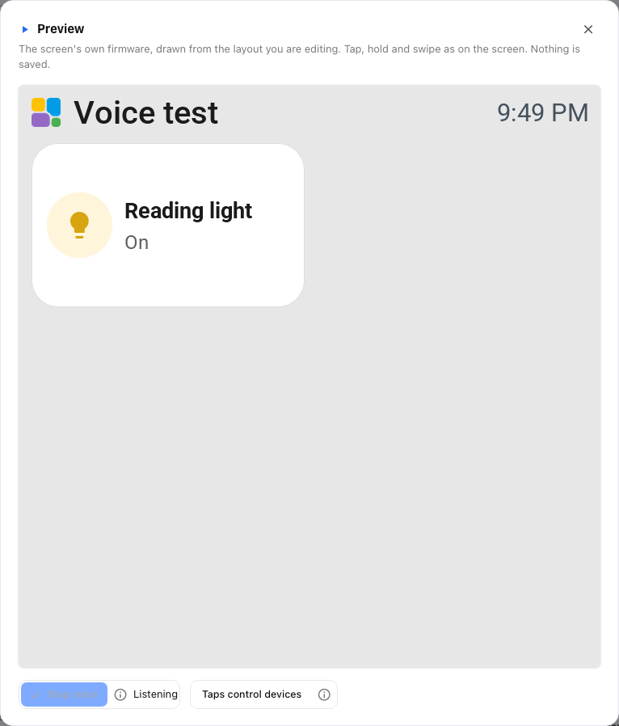

# Browser voice proof of concept

Branch: `voice-assistant-poc`, rebased onto upstream `main`. The voice experiment
uses main's bundled firmware preview and **direct OpenAI Realtime audio**.
The separate player changes are not required or included.
OpenAI has no separate speech-to-text or text-to-speech stage. An optional Claude
route uses Home Assistant speech services; both routes share context and tools.

```text
Browser microphone <------ WebRTC ------> OpenAI Realtime spoken replies
       |                                      |
Firmware preview page                 requested function calls
       |                                      |
       +---------- Screen Manager ------------+
                    /           \
           name resolution     current-information query
           exposure checks             |
                  |             OpenAI Responses web search
            Home Assistant       answer + source links
```

The browser establishes audio through the server's session endpoint. The server
holds the API key and supplies the initial context and tools. Function calls
arriving on the browser's data channel go to authenticated, CSRF-protected manager
endpoints for validation and execution. Local OpenAI replies use WebRTC; selecting
Sonos uses a server WebSocket relay for the same native Realtime audio, as described
under [Reply speaker](#reply-speaker). Closing the preview stops the audio tracks and asks the server to
hang up. Sessions also expire after ten minutes.

The original C++/LVGL firmware still draws the canvas. The voice controls beside
it are browser test controls, not replacement tile rendering or a completed
firmware voice overlay. Physical microphone drivers and panel voice controls
remain separate work.

## Start the experiment

On Home Assistant OS, install this build of Tessera Screen Manager, open its
**Configuration** tab and turn on **Enable voice assistant**. Save and restart
the app, then reopen the editor. The option defaults to off. No container
environment change or file on a developer's computer is needed. The
[installation guide](../screen_manager/DOCS.md#optional-voice-assistant-browser-preview)
lists the separate OpenAI and Claude requirements.

For standalone Docker development, build the editor (`cd web && npm ci && npm
run build`) and use the equivalent environment setting:

```yaml
environment:
  SCREEN_VOICE_ENABLED: "1"
  OPENAI_REALTIME_MODEL: gpt-realtime-2.1
```

In the editor, open **Settings > Voice assistant > OpenAI**, paste the API key into the
password field and select **Save API key**. It takes effect immediately. The
server writes it to `voice-api-key` in the manager's persistent data directory,
with owner-only file permissions. The editor receives only configuration status,
never the stored key. It is not included in layouts or browser storage.
The settings card also lets you replace or remove the saved key. Stop voice
sessions before changing it. Saving does not validate the key or start a paid
session; authentication is checked when starting voice.

`OPENAI_API_KEY` and `OPENAI_API_KEY_FILE` remain optional server configuration
methods. The editor's saved key takes priority; removing it falls back to the
server configuration if present. Environment changes require a manager restart.
API usage, including web-search requests, is
billed to that key's project. Model access depends on that project; the default
model is configurable. The add-on reads the `voice_assistant` boolean from
Supervisor's `/data/options.json`; only `true` enables it. A saved `false`, an
invalid value or an unreadable file keeps it off, even if an environment flag
is set. Disabling and restarting closes sessions without deleting saved keys or
preferences. Standalone Docker can use `SCREEN_VOICE_ENABLED=1` when there is no
options file; the old `SCREEN_VOICE_POC` flag remains a development fallback.

The same settings card has a **Voice** selector. Select a voice and choose
**Save voice**. This is saved in `voice-settings.json` beside the private key,
and applies to new sessions. Existing sessions keep their original voice.
Stop and start voice to hear the change. Saving makes no OpenAI request.
The default is Marin; the server supplies the supported built-in voice choices.

1. In HA, expose the test lights, switches and media players to **Assist** under the voice
   assistant settings. This supplies the exposure boundary, not speech processing.
2. Create or open a virtual screen in ESP Screens. Add the test entities and
   give their tiles clear labels.
3. Open **Firmware preview**. The voice controls are in the bottom row beside
   **Taps control devices**. If no API key is configured, **Configure voice** opens
   the key settings. The tap-control button starts off; a highlight and checkmark
   show when taps can control devices. Starting voice separately permits voice commands.
4. With the key configured, select **Start voice** in the bottom row and grant microphone access.
   The info button beside it explains the session duration and supported controls.
   Use HTTPS or localhost; an embedded page must also permit microphone access.
5. Speak naturally, for example, "Turn on Reading light". OpenAI hears the
   audio directly; Claude uses the selected HA speech services. Replies are
   spoken. Answer text and source links are available in the collapsed details.
6. Select **Stop voice** when finished. While waiting for speech, the configured
   silence timeout also ends the session. Closing the preview stops it too.
   The browser's microphone indicator should disappear afterwards.

### Screenshots

These captures use demo entities and a simulated voice connection. They show
the voice-only branch, with no player extension or real device actions.





## Optional Spotify track search

Reply output is separate from Spotify search and media controls. See
[Reply speaker](#reply-speaker) for general spoken answers on Sonos.

In **Settings > Voice assistant > Spotify search**, enter the **Client ID** and
**Client Secret** of a Spotify developer app and the two-letter country code for
the Spotify account, such as `NL` or `GB`. The card links to the
[Spotify Developer Dashboard](https://developer.spotify.com/dashboard).
An existing developer app used for HA's Spotify integration can also be used;
Screen Manager does not read HA's private OAuth storage. Stop active voice
sessions before changing these settings. Save stores the credentials without a
network call; Spotify access is checked on the first search.

Voice assistant settings use expandable sections for **API credentials**,
**Voice & timing**, **Reply speaker** and **Spotify search**. Open a section to edit it. The Spotify
summary shows **Saved** and the country once configured. Credential fields stay
empty and show replacement placeholders; fill both only when replacing the saved
credentials. Missing provider credentials or HA speech setup open automatically.

Both OpenAI and Claude use this one configuration. The Spotify client-credentials
flow searches the catalogue; it cannot operate a user's playback. All playback
still uses HA actions on Assist-exposed entities. Supported targets are HA's
Sonos and Spotify integrations. For Sonos, link the Spotify account in the Sonos
app first. No additional HA custom integration is needed. For a Spotify player
without a selected output, the assistant asks which listed output to use.

Ask to play a title, optionally naming the artist. The assistant searches first,
then selects a result from that search. Ambiguous artists or versions require a
short clarification. A search-only question does not authorize playback.
Playing a track replaces the player's current queue, including on its Sonos
group. Play/resume without a title resumes existing music.

The server keeps Spotify URIs behind short-lived, player-bound result IDs. It
does not accept model-generated URLs, and checks current exposure and HA action
support again before playing. Failed searches do not resume unrelated music.
Search covers tracks only, not playlists, albums or podcasts. Spotify access,
rate limits and regional availability still apply.

Credentials are stored in `voice-spotify.json` in the manager's persistent data
directory with owner-only permissions. They are never returned to the editor,
included in layouts, or sent to either AI provider. Removing these settings
disables catalogue search while ordinary media controls remain available.

## Naming and actions

- Labels on the current firmware page take priority over HA names and aliases.
  The active page comes from the WASM renderer, not the editor's selected page.
- HA names, aliases and explicit room names remain available as fallback.
  A duplicate label requires clarification. Unexposed visible targets cannot
  silently fall through to another device with the same HA name.
- Context follows the layout actually loaded into the preview, including draft
  edits shown there. This differs from a physical device, which only knows its
  applied layout. A failed preview update must not become voice context.
  Voice controls appear only in the interactive preview, not in overview thumbnails.
- Exposure is refreshed for each HA tool request. Names and states of unexposed
  entities are excluded from the context sent to either provider.
- Lights and switches support explicit on/off. Dimmable lights also accept
  brightness percentages from 0 to 100, with zero meaning off. Both the context
  and execution check HA's brightness field support; on/off-only lights do not
  receive brightness commands. Current brightness is included for relative
  requests when HA reports it.
- Media players, including Spotify, support play/resume, pause, stop, next and
  previous track, repeat one/all/off, volume percentages, volume up/down, mute/unmute and output
  selection, where HA offers those actions. HA's existing action catalogue
  determines support; no player-specific feature bit table is duplicated here.
  Context includes current track, artist, volume and available outputs, not
  artwork URLs or arbitrary entity attributes. Commands are checked again when
  executed because player capabilities can change with playback state.
- Both voice providers understand Dutch and English playback commands. For example,
  "Next track", "Previous track", "Pause", "Stop", "Repeat this song",
  "Repeat all" and "Repeat off" use the same validated HA actions. If a player
  supports pause but not stop, the assistant can pause it to stop the sound.
  A player name can be omitted when there is only one visible media player;
  otherwise the assistant asks which player to use. Repeat sets looping and
  does not restart the track. Seeking is not exposed as a voice action.
- Spotify may offer only output selection while idle. The assistant asks which
  listed output to use, then refreshes context before continuing. It never
  invents output names. Named tracks use the optional Spotify search settings
  below. Searching playlists and creating speaker groups are not supported.
- The server resolves each target itself and only accepts the supported tool
  arguments. Tile-specific custom tap actions are not executed by voice.
- Duplicate tool deliveries return the original result. An uncertain HA timeout
  is retained too, so a retry cannot repeat the same action.
- An accepted HA service call and the observed entity state are reported
  separately. The assistant must not invent hardware confirmation.
- Clear device commands get no spoken preamble and only one short acknowledgement
  after acceptance. There are no offers of further help or conversational
  follow-up questions. Ambiguities and missing output choices get one short
  clarification; errors are reported. General questions still get normal answers.
  This is model instruction, not a guaranteed fixed reply. It does not turn off
  the microphone; use **Stop voice** to end listening.

The model maps natural speech to the supplied canonical names; the server applies
deterministic name priority and rejects ambiguous targets. The PoC has a limit
of 512 exposed entities and four simultaneous audio sessions. Only English and
Dutch browser control text has been authored; other languages currently use
English for this experimental feature.

## Current information and screen help

Ask about current weather or recent news in the same conversation. Realtime calls
`lookup_current_information`, which sends a self-contained question to the OpenAI
Responses API with live `web_search`. No matching HA entity is required. The
lookup receives the question and current time, without the panel layout, HA
credentials or entity catalogue. It has no device-control tools.

The default lookup model is `gpt-5.4-mini`, configurable through the container's
`OPENAI_WEB_SEARCH_MODEL`. It uses the same server-held API key. Realtime still
handles audio directly; the search model receives text only, with no separate
speech-to-text service. Searches use `store: false` and a 30-second timeout.

The assistant is instructed to speak a concise answer without reading URLs
aloud. The preview keeps answer text and clickable **Sources** inside **Text and sources**,
collapsed by default. Expand it to read the answer or follow a source link.
Only a completed search with an answer and usable citations counts as a usable
lookup result. On failure the assistant is told to say that it could not verify
the information, instead of guessing. Duplicate calls reuse the original result;
stopping voice cancels a pending request. Cancellation cannot guarantee that a
provider request already started incurs no charge.

Source links clear with the next spoken question or new session, and stay with
the last answer after Stop. A result arriving after the user interrupts does not
attach sources to the new question or trigger a late reply.

Ask "What can I control on this screen?" or "How do I dim Reading light?" for
help. The assistant is instructed to read the current page, use its visible tile
names and explain supported actions without operating devices. This is prompt
behaviour; live spoken acceptance remains necessary.

## Provider boundaries

Choose **OpenAI** or **Claude** in the same Settings card. Each provider retains
its own private key. Switching requires stopping active sessions; it never
silently falls back to another provider. Existing OpenAI keys and voice settings
remain compatible.

| Layer | Code | Responsibility |
|---|---|---|
| Shared assistant tools | `screen_manager/app/assistant_tools.py` | Instructions, visible names, exposure and action validation, neutral tool schemas |
| Session coordination | `screen_manager/app/voice_preview.py` | Settings, session lifetime, duplicate-call receipts, common tool dispatch |
| Text conversation | `screen_manager/app/assistant_conversation.py` | Bounded history and tool rounds for text providers |
| Provider interfaces | `screen_manager/app/voice_providers.py` | Separate native audio, text conversation and public lookup contracts |
| Claude API | `screen_manager/app/voice_anthropic.py` | Messages/tool-result format, public web search and citation normalization |
| HA speech | `screen_manager/app/voice_ha_speech.py` | Installed-engine checks and isolated STT/TTS pipeline stages |
| Browser audio | `web/src/model/voice-openai.ts`, `voice-claude.ts` | Direct WebRTC for OpenAI; PCM capture and HA speech playback for Claude |

OpenAI's Realtime model drives audio and tool turns directly. Claude runs text
turns through the shared conversation coordinator. Both call the same server
executor, with fresh exposure and capability checks. Audio, text and lookup
adapters remain separate; adding a text provider does not replace native audio.

## Configure Claude with Home Assistant speech

1. Install speech-to-text and text-to-speech services in HA. Local **Whisper** and
   **Piper** are supported through the standard [Wyoming integration](https://www.home-assistant.io/integrations/wyoming/).
   HA OS has speech apps. With HA Container, run the Wyoming services in separate
   containers and add their hosts and ports through HA's integration setup.
   For general questions, use an open-ended recognizer such as Whisper rather
   than a recognizer restricted to predefined device commands.
2. In **HA Settings > Voice assistants**, create an assistant with those STT/TTS
   engines, language and voice. The conversation agent chosen there is unused
   by this route; no HA Anthropic integration is required.
3. In **ESP Screens > Settings > Voice assistant**, choose **Claude**, save its
   API key, select the HA voice assistant and save the speech settings.
4. Reopen Firmware preview and choose **Start voice**. Pause after speaking.
   Claude's reply is read aloud by HA. Expand **Text and sources** to read it.
   The microphone resumes listening after the reply. Use **Stop voice** to
   interrupt or end the session.

Settings checks that both engines are installed, support the configured languages
and are not marked unavailable by HA. Missing STT or TTS is shown on each choice.
Start rechecks readiness before creating a session. A configured service can still
fail at runtime, so the pipeline reports recognition/playback failures separately.

```text
Microphone -> 16 kHz PCM -> HA STT -> Claude + shared tools -> HA TTS -> speaker
                                      |
                                  Claude web search -> source links
```

The [HA Assist pipeline API](https://developers.home-assistant.io/docs/voice/pipelines/)
runs STT and TTS independently. It never runs HA's intent stage, avoiding duplicate
actions. HA credentials and Claude's key stay on the server. Generated speech is
relayed from HA through a session-scoped endpoint; no HA token reaches the browser.
Claude sees recognised text and exposed panel context, not microphone audio.
Public web search receives only the question and current time, never HA context.

The Claude key is saved as `voice-claude-api-key` with owner-only permissions.
Optional server configuration is `ANTHROPIC_API_KEY` or `ANTHROPIC_API_KEY_FILE`.
`ANTHROPIC_MODEL` defaults to `claude-sonnet-4-6`; it applies to conversation and
Claude web search. API usage is billed by Anthropic. Saving a key does not test
billing/model access; the first turn does. Web search must be enabled for that
Anthropic organization. Claude model capabilities are documented
[here](https://platform.claude.com/docs/en/models/overview).

This first Claude transport is turn-based: 30 seconds per utterance, ten minutes
per session, no wake word and no spoken interruption while a reply is playing.
The browser uses echo cancellation, noise suppression and a simple silence
endpoint. Real microphones and room noise still need acceptance testing.
OpenAI retains its native realtime turn detection and interruption behavior.

Histories and audio are bounded and held in manager memory, not layouts or browser
storage. HA and speech/AI providers have their own retention settings. Repeated
turn uploads and repeated tool IDs reuse recorded results; failed or uncertain
actions are not automatically retried. Stop cancels pending speech/model work.
An action already accepted by HA cannot be undone by stopping voice. If TTS fails
after an action, keep the reply under **Text and sources** and do not repeat the command.

## Validation and remaining work

Physical wake-word activation remains separate work. It should start the same
general conversation and reuse these tools. See the
[activation and lookup design](VOICE_ASSISTANT_RESEARCH.md#general-questions-after-activation).

The project checks passed on this branch. A Chrome check of the deployed lab
verified the 720 x 720 firmware canvas, the renamed tile's voice context and the
iframe's microphone policy. The action handler also switched a simulated HA
light on and off and restored its original state. A live spoken light-control
test has also been reported successful. The later brightness, media and voice
selection additions have automated coverage; live spoken acceptance for those
features remains a separate check.

The automated tests use fake OpenAI, Claude and HA endpoints. They cover direct-audio
session configuration, name precedence, page changes, HA aliases, duplicate
names, exposure revocation, deduplication, connection loss and microphone cleanup.
They also cover media action mapping, output validation, invalid percentages,
current player capabilities, brightness field support, and voice persistence
without changing active sessions or returning credentials.
Lookup tests cover the Responses request, citation validation, incomplete or
unsourced answers, provider failures, cancellation, duplicate requests and late
results after interruption. Browser transport tests use simulated audio.
The shared-tool tests also use a substitute audio provider to verify that provider
changes do not duplicate or bypass name resolution and HA action validation.
They do not establish recognition quality, cloud model access, acoustic echo
handling or physical board performance.

For the live acceptance test, try renamed tiles, ordinary Dutch phrasing,
corrections, duplicate labels in different rooms and follow-up questions. Verify
the entity state in HA, change pages and repeat, then stop voice and check the
microphone indicator. Test HA loss and recovery separately. Do not interpret a
successful browser test as validation of the panel's onboard microphones.

References: [OpenAI WebRTC setup](https://developers.openai.com/api/docs/guides/voice-webrtc?voice-api=realtime),
[Realtime tool results](https://developers.openai.com/api/docs/guides/realtime-conversations),
[Realtime reply instructions](https://developers.openai.com/api/docs/guides/voice-prompting),
[OpenAI web search](https://developers.openai.com/api/docs/guides/tools-web-search),
[HA media players](https://www.home-assistant.io/integrations/media_player/),
[Spotify output limitations](https://www.home-assistant.io/integrations/spotify/#selecting-output-source),
[voice research and hardware limits](VOICE_ASSISTANT_RESEARCH.md).

The Claude route also passed an actual HA STT -> Claude -> HA TTS round trip
using a synthetic Dutch general-knowledge question, with no device actions.
Chrome captured generated input with the real AudioWorklet under the editor CSP
and played HA-generated speech using a simulated Claude reply. Cancellation,
missing services, revoked exposure, duplicate uploads and private-key persistence
have automated coverage. This does not establish physical microphone quality,
room-noise performance or spoken device-control acceptance for Claude.

A live Claude public-weather lookup also returned a completed answer with usable
source links. This checks the search adapter and citation contract, not a guarantee
that every weather source has a recent observation for every requested location.

### Slow Claude turns

The preview reports speech recognition, reasoning, current-information lookup and
speech preparation separately. A weather request includes several sequential
services and can take longer than a direct command. The manager logs stage
durations only, without transcripts or credentials. Server processing is limited
to two minutes; the browser also bounds the total turn wait and releases the
microphone on failure. Stop cancels pending work; audio and actions are not retried.

If local Whisper is slow or hallucinates on room noise, its standard `--vad-filter`
option can reject non-speech before decoding. This is a speech-service setting,
not a mandatory Screen Manager dependency or a change to OpenAI direct audio.
Actual microphone quality and room-noise performance still need local testing.

With the filter enabled, a synthetic Dutch recognition check completed in about
three seconds. A full Chrome weather turn through the deployed manager, HA speech
and Claude took about 25 seconds from Start voice to playback, including capture.
The browser showed recognition, search and speech-preparation progress, followed
by spoken playback and three clickable sources. These are lab observations, not
latency guarantees; no device actions or physical microphone test were performed.

### Automatic stop while waiting for speech

Both browser voice providers stop after five seconds waiting for speech by
default. In **Settings > Voice assistant > Voice & timing > Stop after silence (seconds)**, save
a value from 1 to 300. The silence timeout is always active; older saved values
of 0 use the five-second default. Reopen the preview to load
the saved setting. Speech, processing, tool calls and spoken playback pause the
timer. A fresh countdown starts when the assistant finishes its reply. Expiry
closes the microphone and server session, just like Stop voice. The existing
ten-minute maximum session lifetime still applies.

Commands that start or resume music, including next/previous, end voice after
the short spoken acknowledgement. Input is suspended before playback starts;
failed commands resume listening with a fresh configured silence timeout.
Press **Start voice** again for another command. Other commands and
general questions keep the normal conversation and silence timeout.

Both providers request browser echo cancellation, but external speakers such as
Sonos do not supply their playback audio to the browser as a cancellation
reference. Ending the session prevents those lyrics from becoming a new voice
request. This does not cancel music already playing when a new session starts.

This is a browser feature. Physical firmware will need to implement the same
session policy around its local wake-word detector. There, ending a conversation
should stop streamed audio and return to local wake-word listening, unless the
microphone is explicitly muted. Device audio transport and wake-word activation
remain unimplemented.

### Clean image verification

After building the add-on image, run:

```sh
python3 tools/check_voice_install.py --image <built-image>
```

The check starts the packaged server in a disposable container with empty
`/data` and `/config`, no network and no host mounts. It checks default-off
behaviour, enabling through the normal options file, editor assets, private
credential persistence, provider switching, missing Claude speech services,
and disabling and re-enabling. It uses dummy keys and makes no AI calls.
Only HTTP access uses the local development allowlist, because there is no
Supervisor ingress in that container. It does not replace a Home Assistant OS
installation check, live provider authentication or actual microphone and Sonos
playback acceptance.

### Optional physical-device packaging

The current implementation adds no firmware code or flash usage. The
`voice_assistant` add-on option is global to Screen Manager and enables browser voice;
it is not a per-device firmware setting.

Physical voice support must remain opt-in for each device, using the existing
ESPHome package structure and `packages/features/` convention. A compatible board
provides its hardware profile; each device can then include the optional voice
feature package. A device without that package must compile without microphone,
wake-word and voice-streaming components. A runtime microphone switch is a
separate control and does not remove compiled code. API credentials and shared
assistant tools stay in Screen Manager. Per-device selection and physical audio
transport are future board-support work, not implemented in this browser PoC.

### Reply speaker

In **Settings > Voice assistant > Reply speaker**, choose **Screen / this browser**
or a Sonos speaker from Home Assistant, and set its reply volume. Stop voice before
saving and reopen the preview afterwards. The selected speaker needs no media tile,
Spotify account, or Assist exposure: this explicit output selection is separate
from which entities voice commands may control. Removed or unavailable speakers
must be reselected; the app does not silently redirect private replies elsewhere.

Both providers use the same reply delivery. OpenAI local output keeps WebRTC;
external output streams 24 kHz PCM through the manager to the same Realtime model
and buffers its generated audio as WAV. There is no extra STT or TTS stage. Claude
uses the selected HA speech engine and sends its generated WAV or MP3 to the same
output layer. Music-start confirmations remain local and close the conversation.

Sonos plays the reply through HA's `media_player.play_media` announcement action,
with its own reply volume. Audio lives in bounded manager memory, with one reply
per session, a one-minute limit and unguessable temporary download links. The
speaker must reach the manager's published media port, **8098** by default, also
used for images. The normal add-on reads a changed host port from Supervisor;
a standalone Docker deployment must publish it on the LAN too.
`SCREEN_CAMERA_URL`, when configured for image delivery, is also
the media base address for replies. HA must reach the Sonos announcement endpoint;
see [HA Sonos network requirements](https://www.home-assistant.io/integrations/sonos/#network-requirements).

Microphone input pauses during external replies. HA's Sonos action confirms
acceptance, not the end of an announcement. The app therefore waits for the speaker
to download the complete clip and then for its measured duration plus 1.5 seconds.
This is a conservative timing guard, not a verified Sonos playback-finished event.
After it passes, listening resumes with a fresh configured silence timeout. Missing
downloads, unavailable speakers and stalled delivery end the voice session.

Stop closes the microphone, cancels pending work and revokes download links. An
announcement already downloaded by Sonos may finish playing. Its output remains
reserved until the guard expires, preventing a new voice session from hearing that
reply. The app does not stop the speaker's music or another app's announcement to
cancel voice. Local OpenAI output permits spoken interruption only when the browser
reports echo cancellation enabled; this still requires real-room acceptance testing.
Claude keeps input paused through all replies. Hardware wake-word activation remains
separate work and is not enabled by selecting Sonos output.
